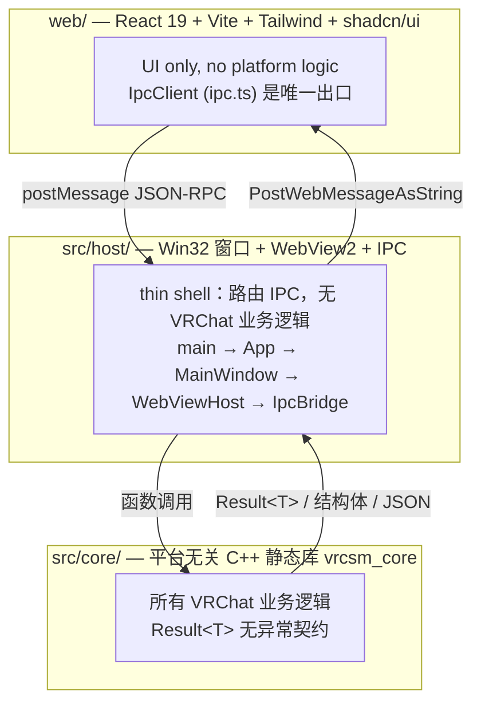

# 架构与层次模型

> 上级：[参考文档索引](README.md)　|　相关：[IPC 往返链路](flows/ipc-roundtrip.md)、[宿主 + IPC bridge](02-host-ipc-bridge.md)、[前端](03-web-frontend.md)

本页定义 VRCSM 的整体分层、进程内边界、IPC 协议与统一错误模型。它是阅读所有子系统文档前的公共上下文。

## 1. 三层模型

VRCSM 是一个两层进程内嵌套：C++ Win32 宿主进程内嵌 WebView2，WebView2 渲染 React SPA。逻辑上分三层：



层职责严格分离（对齐 `CLAUDE.md` 的 Architecture 段）：

- **`web/`** —— 纯 UI。所有副作用都经 `ipc.call(...)` / `ipc.on(...)`（`web/src/lib/ipc.ts`），无任何平台逻辑。见 [前端文档](03-web-frontend.md)。
- **`src/host/`** —— 薄壳。创建无边框 Mica 窗口、初始化 WebView2、把本地 `web/` 目录映射为可信虚拟主机 `https://app.vrcsm/`、把所有 IPC 经 `IpcBridge::DispatchFromOrigin()` 路由到 core。不含 VRChat 业务逻辑。见 [宿主文档](02-host-ipc-bridge.md)。
- **`src/core/`** —— 静态库 `vrcsm_core`。所有 VRChat 逻辑：缓存扫描、日志解析、bundle 解码、路径解析、junction 迁移、安全删除、VRChat API、认证、设置、头像预览。除 junction/进程模块外零 Win32 依赖。见 [核心子系统总览](core/README.md)。

## 2. IPC 协议

JSON-RPC 风格，经 `postMessage` / `PostWebMessageAsString` 传输。三种信封（前端类型定义 `web/src/lib/types.ts:567-588`）：

```
Request:  { id: "uuid", method: "scan", params: {} }
Response: { id: "uuid", result: {...} }  或  { id: "uuid", error: { code, message, httpStatus? } }
Event:    { event: "migrate.progress", data: {...} }   // 宿主主动推送，无 id
```

- **前端侧**：`IpcClient`（`web/src/lib/ipc.ts`）用 `pending` Map 配对请求/响应，`IpcError` 携带机读 `code` 与 `httpStatus`。
- **宿主侧**：`IpcBridge::DispatchFromOrigin()`（`src/host/IpcBridge.cpp:442`）按方法名匹配 handler。方法名若在 `AsyncMethodSet()`（`src/host/IpcBridge.cpp:98`）中则投递到线程池 worker 执行，结果经 `WM_APP_POST_WEB_MESSAGE` 编组回 UI 线程再送达前端。

三种调度语义（sync 内联 / async worker / event-push）的完整往返过程见 [IPC 往返链路专章](flows/ipc-roundtrip.md)。

### 来源门禁（安全接缝）

`DispatchFromOrigin` 的第一件事是按调用来源分类（`src/host/IpcBridge.cpp:459-478`）：

- 来源可解析为插件 id → 视为插件调用，只允许 `plugin.rpc`（`PluginReachableMethods()`，`src/host/IpcBridge.cpp:300-306`），其余 `forbidden_origin`。
- 来源 host 非 `app.vrcsm` → `forbidden_origin` 拒绝。
- 来源为 `app.vrcsm`（可信 SPA）→ 全权。

这是整个应用唯一的 IPC 权限边界，详见 [插件安全专章](flows/plugin-security.md)。

## 3. 统一错误模型

core 库**不抛异常**，统一用 `Result<T> = std::variant<T, Error>`（`Common.h:32-33`）表达可失败结果。

- `Error` 结构：`code`（机读字符串）、`message`（人读）、`httpStatus`（默认 0，为 0 时序列化省略）（`Common.h:16-30`）。
- 访问器 `isOk` / `value` / `error`（`Common.h:35-51`）。
- `to_json(Error)` 序列化为 `{code, message[, httpStatus]}`（`Common.h:23-30`）。

IpcBridge 把 `Result` 失败转成 JSON error 响应；前端 `IpcClient` 再把它 reject 成 `IpcError` 异常，携带机读 `.code`。这条链路让前端可以按 `code` 分支处理（如 `auth_expired` 触发全局登出）。

> [!NOTE] 例外：core 中 `JunctionUtil::Repair` 用 `throw std::runtime_error`（`JunctionUtil.cpp:220` 等多处），由宿主层 try/catch 转 JSON error。这是 core 无异常契约的少数例外。

## 4. 关键跨切面约束（来自 CLAUDE.md）

- **绝不在开发期修改用户 VRChat 数据。** 破坏性操作默认 dry-run。
- **迁移/删除前检测 VRChat.exe** —— 运行中则阻断（`ProcessGuard`）。
- **迁移用 NTFS junction 而非符号链接**（无需管理员权限）。
- **批量删除时保留 `Cache-WindowsPlayer` 根下的 `__info` 和 `vrc-version`。**
- **全程 UTF-8**，`wchar_t` 仅在 Win32 API 边界出现，立即用 `toUtf8()`/`toWide()` 转换。

## 5. 命名澄清（重要）

代码库中有两处名字撞车，阅读时务必区分：

| 名字 | 含义 A | 含义 B |
|---|---|---|
| **Pipeline** | **报告聚合流水线**：`Report.cpp` 的 `BuildFullReport`，是文件系统扫描器的并行聚合 | **`Pipeline` 类**（`Pipeline.h:31`）：VRChat 实时事件 WebSocket 客户端，连 `pipeline.vrchat.cloud`。名字来自 VRChat 官方术语 |
| **stableHashHex** | 名为 40 hex 字符、形似 sha1 | 实为 **FNV-1a 64 位折叠**，非加密强度（`AvatarPreview.cpp:528-534`）。仅需稳定性 |

`Pipeline` 类详见 [编排层文档](core/orchestration.md)，报告聚合详见同页与 [数据生命周期专章](flows/data-cache-lifecycle.md)。

## 6. VRChat 数据路径

- 基目录：`%LocalLow%\VRChat\VRChat\`（`PathProbe::Probe().baseDir`）。
- 缓存条目：`Cache-WindowsPlayer/` 下十六进制命名目录，含 `__info`（文本）与 `__data`（UnityFS 二进制）。
- 本地头像数据：`LocalAvatarData/<usr_xxx>/<avtr_xxx>` 为无扩展名 JSON。
- 日志：基目录下 `output_log_<timestamp>.txt`。

VRCSM 自有数据路径：`getAppDataRoot()` = `%LocalAppData%\VRCSM`（`Common.cpp:334-337`），下含 `vrcsm.db`、`session.dat`、各磁盘缓存。所有权规则见 [`docs/CACHE-ARCHITECTURE.md`](../CACHE-ARCHITECTURE.md) 与 [数据生命周期专章](flows/data-cache-lifecycle.md)。
