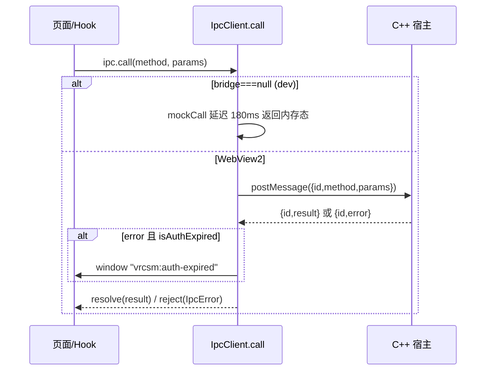

# Web 前端：IPC 客户端 / 页面 / 组件 / Hooks

> 上级：[参考文档索引](README.md)　|　相关：[架构](01-architecture.md)、[IPC 往返链路](flows/ipc-roundtrip.md)、[数据生命周期](flows/data-cache-lifecycle.md)

`web/` 是纯 UI 层（对齐 `CLAUDE.md`）。所有副作用流经 `ipc.call(...)` / `ipc.on(...)`（`web/src/lib/ipc.ts`）或 `subscribePipelineEvent`（`web/src/lib/pipeline-events.ts`）。无平台逻辑，无对宿主返回内容的信任提升。

## 1. IPC 与数据访问层（`web/src/lib`）

该层是 React SPA 与 C++ 宿主间唯一通信边界，封装 JSON-RPC-over-postMessage 成带类型的 Promise API。

### 1.1 IpcClient（`ipc.ts`）

结构（`ipc.ts:465-492`）：`bridge`（`window.chrome?.webview`，浏览器 dev 下为 null）、`pending` Map（id → {resolve,reject,timerId}）、`events` EventTarget（宿主主动推送总线）。`bridge===null` 是**运行模式唯一判据**：为 null 则走 mock（`isMock`）。

**请求/超时模型 `call()`（`:558-588`）**：

1. 无 bridge → `mockCall`。
2. 生成 `id=uuid()`，组 `{id, method, params?}`（`params===undefined` 时不写入）。
3. **超时分级**：普通 IPC 60 秒，`LONG_RUNNING_METHODS`（`scan`/`avatar.bundle.download`/`avatar.preview`/`favorites.sync*`/`prints.upload`/`files.uploadImage`）15 分钟；`migrate.execute` 不设渲染端响应超时，因为大型缓存迁移可能超过任何固定上限且宿主仍在执行。超时调用会从 `pending` 删除并 reject `IpcError("timeout")`；无超时的迁移调用由宿主响应或 `cancelAll` 清理。
4. 存 pending，`postMessage` 后返回 Promise。

**响应/事件分发 `handle()`（`:502-547`）**：坏 JSON/非对象静默丢弃；含 `"event"` → `CustomEvent` 派发到 `events` 总线；含 `"id"` → 查 pending，有 `error` 则构造 `IpcError`（`isAuthExpired` 时额外派发 window 级 `vrcsm:auth-expired`）后 reject，否则 resolve。

**`cancelAll(reason)`（`:597-607`）**：遍历所有 pending 清 timer 并 reject。由 `cache-ownership.ts` 在 logout/auth-expired/account-switch 时调用，防上一账号的长任务把 slot 带过账号边界。

**`IpcError`（`:378-393`）**：镜像 C++ `Error` 形状，`isAuthExpired` 判 `code==="auth_expired" || httpStatus===401` —— 全局登录过期拦截判据。

### 1.2 领域封装与 React Query

两种封装风格并存：IpcClient 内联方法（约 132 处 `this.call<>`）+ 独立函数模块（`vrchat-api.ts`/`history-api.ts`/`osc-api.ts`/`shell-api.ts`/`feed.ts`/`social.ts`）。

- **React Query 集成**：`queryClient.ts` 默认 `staleTime`/`gcTime` 5 分钟、`retry:1`、关闭 `refetchOnWindowFocus`。`qk`（`query-keys.ts:11`）用 `[method, params]` 元组作 key。`useIpcQuery`（`hooks/useIpcQuery.ts:5`）的 key 结构与 `qk` 输出一致。
- **限流**：`api-throttle.ts` 的 `vrcApiThrottle`（并发 3、每秒 5 次）避免头像详情扇出触发 VRChat 429。
- **账号级缓存清理**：`cache-ownership.ts` 用 `qk.*Root` 在会话切换时 `removeQueries`，清 localStorage 与进程内缓存，并 `ipc.cancelAll`。

### 1.3 Mock-IPC（浏览器 dev + 测试）

仅 `bridge===null` 时触发。mock 数据模块动态 `import("./__mocks__/ipc-mock-data")` 懒加载（生产构建里永不触达）。`mockCall`（`:609-2241`）巨型 `switch(method)`，固定延迟 180ms，未覆盖方法抛 `IpcError("mock_not_implemented")`。单测**不走** mockCall，而是 `vi.mock("@/lib/ipc")` 直接替换。

## 2. 路由与页面

### 2.1 路由表（`web/src/App.tsx:528-558`）

所有页面 `lazy()` 懒加载，挂在 `<Suspense>` + `RouteErrorBoundary`（以 `location.pathname` 为 resetKey）下。关键重定向：`/models`→`/avatars?tab=owned`、`/vrcplus`→`/vrchat?tab=vrcplus`、`/friend-log`→`/radar`。

> [!NOTE] **GameLog 与 FriendLog 不是顶层路由**。它们的命名导出 `GameLogPanel`/`FriendLogPanel` 在 `Radar.tsx` 内以 `embedded` 形式渲染。各自的 `export default` 是未使用的独立包装。

### 2.2 共享数据基础设施

- **`ReportProvider`/`useReport`**（`report-context.tsx`）：全应用**单次** `ipc.scan()`，挂载 `ensure()` 触发一次，仅标题栏 Rescan 调 `refresh()`。Dashboard/Worlds/Bundles/Logs 共读。以 `report.generated_at` 作为下游 effect 重取信号。
- **`history-api.ts`**：`listWorldVisits`/`listPlayerEvents`/`listFriendLog`/`listAvatarHistory`/`clearHistory`/`searchGlobal`。
- **`pipeline-events.ts`**：`subscribePipelineEvent(type, handler)` 是对 `ipc.on("pipeline.event")` 的按 type 过滤封装。
- **`library.ts`**：`useFavoriteLists`/`useFavoriteItems`/`useFavoriteActions`，mutation 后 invalidate `qk.favorites.*`。

### 2.3 页面数据依赖速查（选摘）

| Page | 主 IPC/hook | 实时事件 |
|---|---|---|
| Dashboard | useReport, friends.list, screenshots.list, listWorldVisits/PlayerEvents | — |
| Avatars | avatar.details, user.search, db.avatarHistory.list, searchAvatars（throttle） | — |
| Friends | friends.list（命令式 useState 缓存）, friendNote.all, world.details, favorites.* | FRIEND_PIPELINE_EVENT_TYPES |
| Bundles | useReport, bundle.preview, delete.dryRun/execute | — |
| Screenshots | screenshots.list/open/folder/delete | — |
| Logs | useReport(report.logs), logs.stream.start/stop | `logs.stream.event`（分类） |
| GameLog(panel) | logs.stream.start/stop | `logs.stream`（原始行） |
| VrcPlus | printsList/filesList/inventoryList, user.me, uploads | — |
| Settings/TabData | dataUsage, dataClear | — |
| SocialGraph/WorldHistory/AvatarBenchmark | dbWorldVisits/dbPlayerEvents/dbAvatarBenchmarks + 内联 Clear（dataClear） | — |

### 2.4 值得注意的模式与风险点

- **两套 friends.list 缓存并存**：Friends 页用自有 `useState`+localStorage，应用其余部分用 React Query `friends.list`（经 `useFriendsPipelineSync` 保鲜）。两者都订阅同一批 pipeline 事件 —— 重复处理，是历史迁移遗留（`useFriendsPipelineSync.ts:75-77`）。轮询用 `__polledAt` 时间戳防覆盖 pipeline 增量。
- **两个不同的日志流事件名**：Logs 页监听 `logs.stream.event`（结构化），GameLog panel 监听 `logs.stream`（原始行）。共享同一 host tailer，靠 `logs.stream.start/stop` 引用计数协调。
- **删除采用 dryRun→execute 两步 + 回传 targets**：Bundles 删除先 `delete.dryRun` 拿真实 targets，确认后 `delete.execute` 回传精确列表而非重解析，规避竞态。符合 CLAUDE.md dry-run 约束。
- **hidden 头像特例**：ModelDb 因 VRChat list hidden 返回 401，`isHidden` 时跳过 list query 改按 id 查。
- **前后端 data.clear target 映射两处不同步**，详见 [数据生命周期专章](flows/data-cache-lifecycle.md)。

## 3. 组件（`web/src/components`）

三层：

- **Tier A — shadcn/ui 原语**（`components/ui/`）：Radix 包装、`cva` 变体、`cn()` 组合，重塑为 "Unity editor" 扁平风。button/card/badge/dialog/input/slider/table/dropdown-menu/context-menu/sonner 等。`alert-dialog.tsx` 是 `dialog.tsx` 的薄别名（非 Radix AlertDialog）。
- **Tier B — 可复用领域组件**：`ConfirmDialog`（共享确认原语，`loading` 时锁关闭）、`ThumbImage`（确定性渐变+缩写占位，`seedKey` 用 id 非 URL）、`IdBadge`/`EntityLink`（VRChat id 点击分发，经 `shell.openUrl` 开外链）、popup badge 家族（`UserPopupBadge`/`WorldPopupBadge`/`AvatarPopupBadge`，dialog 打开时才 lazy-fetch）、`ProfileCard`、`AvatarPreview3D`（React-Three-Fiber，`useGLTF.clear()` 防 GPU 泄漏）、`FriendDetailDialog`、`RelationshipGraph`（零依赖确定性力导向图，golden-angle 播种保测试稳定）、`ActivityHeatmap`。
- **Tier C — app-shell chrome**（挂载一次）：Sidebar/MenuBar/TitleBar/Toolbar/StatusBar/BottomDock/RightDock/NotificationsInbox/CommandPalette。`RouteErrorBoundary` 是唯一 class 组件（Suspense 不捕 throw）。

## 4. Hooks

### 数据访问

- **`useIpcQuery`**（`hooks/useIpcQuery.ts:5`）：核心 React Query↔IPC 适配器，几乎所有详情 fetch 走它。
- **`useAvatarPreview`**（`hooks/useAvatarPreview.ts:56`）：预览状态机。cleanup 触发 `avatar.preview.abort`（依赖 React cleanup-before-effect 顺序作为中止机制）；对瞬态错误码一次透明自动重试；第二个 effect 用 retain/release 引用计数管 GLB。

### Pipeline-bridge hooks（都在 App.tsx 挂载一次）

- **`useFriendsPipelineSync`**：把 friend-* 事件桥进 `["friends.list"]` React Query 缓存，并 diff 写 `friend_log`、记 presence、记 avatar sighting。
- **`useDiscordPresence`**：opt-in Discord RPC。安全相关：`discordPresenceVisibility(location)`（`:53`，可单测的隐私门）—— 只 `public`/`group-public` 实例暴露实例细节，其余只发世界名，**从不发原始 `~private(usr_…)` 串、party、join secret**。
- **`useStrangerAlert`**：非好友加入非公开实例时 toast，60s per-stranger 去抖。
- **`useScreenshotAutoInject`**：从 pref 切换 C++ 截图 watcher。

### OSC studio 大 hook

`useOscStudio.ts`（673 行）：profiles/cards（localStorage）、硬件遥测（5s 自动刷新）、发送、auto-send 循环（`runId` 重入守卫 + 漂移校正调度）、监听器。Chatbox 限流：手动 5 次/5s、auto 每 2s、144 字符截断。

## 5. 线程/生命周期与安全

- **UI 线程唯一**：所有 handler 在 WebView2 UI 线程执行；异步性仅来自宿主 worker（经 `WM_APP_POST_WEB_MESSAGE` 回投）。
- **卸载安全模式一致**：`cancelled`/`alive`/`activeRef` 标志守 setState-after-unmount；每个订阅返回 unsubscribe。
- **泄漏防护**：pending slot 由"响应/超时/cancelAll"三条路径清理，超时上限有限。
- **全局鉴权拦截**：`auth_expired`/401 触发 window 级 `vrcsm:auth-expired`，由 `auth-context.tsx` 消费 `resetAccountScopedCaches`，页面无需各自写鉴权检查。
- **安全**：无组件从不可信字符串构造 HTML（描述渲染为文本节点，`whitespace-pre-wrap`）；外链只经 `ipc.call("shell.openUrl")`（宿主控制实际执行）；popup badge 的 `enabled: open && id.startsWith(...)` 门控既省成本又防对畸形 id 发详情请求。

## 相关文件

- `web/src/lib/ipc.ts`、`types.ts`、`query-keys.ts`、`queryClient.ts`、`cache-ownership.ts`、`pipeline-events.ts`、`{vrchat,history,osc,shell}-api.ts`、`api-throttle.ts`、`useOscStudio.ts`
- `web/src/hooks/useIpcQuery.ts`、`useAvatarPreview.ts`
- `web/src/lib/{useFriendsPipelineSync,useDiscordPresence,useStrangerAlert,useSelfLocation,useScreenshotAutoInject}.ts`
- `web/src/App.tsx`、`report-context.tsx`、`library.ts`、`pages/*`、`components/*`

**未验证项**：`ipc.ts` mockCall 分支与部分内联包装方法为抽样阅读，未逐一核对每个 method 字符串与宿主实现的一一对应。
