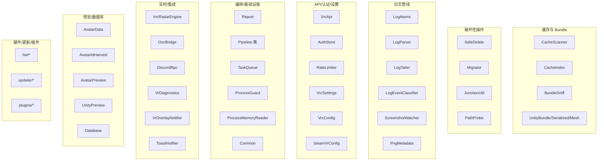

# C++ 核心库 vrcsm_core — 子系统总览

> 上级：[参考文档索引](../README.md)　|　相关：[架构](../01-architecture.md)、[宿主 + IPC bridge](../02-host-ipc-bridge.md)

`src/core/` 是静态库 `vrcsm_core`，承载所有 VRChat 业务逻辑，除 junction/进程模块外零 Win32 依赖。它对外暴露 `Result<T>` 或结构体/JSON，由宿主层 bridge 转成 IPC 响应。本页给出模块地图与阅读入口。

## 模块地图

## 分区导航

| 分区 | 文档 | 覆盖模块 |
|---|---|---|
| 缓存扫描 + Unity 解码 | [cache-and-bundle](cache-and-bundle.md) | CacheScanner, CacheIndex, BundleSniff, UnityBundle/Serialized/Mesh |
| 安全删除 / 迁移 / 路径 | [safedelete-migrate](safedelete-migrate.md) | SafeDelete, Migrator, JunctionUtil, PathProbe, `ensureWithinBase` |
| 日志管线 | [log-pipeline](log-pipeline.md) | LogAtoms, LogParser, LogTailer, LogEventClassifier, ScreenshotWatcher, PngMetadata |
| API / 认证 / 设置 | [api-auth-settings](api-auth-settings.md) | VrcApi, AuthStore, RateLimiter, VrcSettings, VrcConfig, SteamVrConfig |
| 编排 / 基础设施 | [orchestration](orchestration.md) | Report, Pipeline 类, TaskQueue, ProcessGuard, ProcessMemoryReader, Common |
| 实时 / 外部集成 | [realtime-integrations](realtime-integrations.md) | VrcRadarEngine, OscBridge, DiscordRpc, VrDiagnostics, VrOverlayNotifier, ToastNotifier |
| 头像预览 / 数据库 | [avatar-preview-db](avatar-preview-db.md) | AvatarData, AvatarIdHarvest, AvatarPreview, UnityPreview, Database |
| 硬件 / 更新 / 插件 | [hw-updater-plugins](hw-updater-plugins.md) | hw/*, updater/*, plugins/* |

## 贯穿核心的公共原语（`Common.h` / `Common.cpp`）

这些原语被多个分区共享，是安全设计的基石：

- **`Result<T>` / `Error`** —— 无异常错误模型（`Common.h:16-51`）。见 [架构文档 §3](../01-architecture.md#3-统一错误模型)。
- **`ensureWithinBase(base, candidate)`** —— 路径穿越守门人（`Common.cpp:191-216`）。刻意用 `absolute()+lexically_normal()` 而非 `weakly_canonical()`，以免解引用用户已迁移缓存的 junction 导致容器检查失效（`Common.cpp:171-182`）。删除、迁移、预览、插件安装全都依赖它。
- **`secureClearString` / `secureWipeBytes`** —— 凭据擦除（`Common.h:92-115`）。按 `capacity()` 全量 volatile 清零，防 `clear()` 只重置 size 后 capacity 区残留明文 cookie/password 被 crash dump 或 DLL 注入读到。
- **`nowIso()` / `isoTimestamp()`** —— 产出**本地时区**（带偏移）ISO8601，非 UTC（`Common.cpp:38-64`）。报告 `generated_at`、DB `first_seen_at` 都是本地时间。
- **`getAppDataRoot()`** —— `%LocalAppData%\VRCSM`（`Common.cpp:334-337`）。
- **`formatBytesHuman`** —— 二进制单位（B/KiB/…/TiB）（`Common.cpp:21-36`）。

## 线程模型总结

core 内多处使用函数内 `static` 单例（各自 mutex 保护）：`RateLimiter`、`AuthStore`、`Database`、`CacheIndex`、`ProcessGuard` watcher、缩略图 `cacheState`。宿主的 IPC async 方法在 detached 线程池 worker 上调用这些 core 函数，因此 core 的线程安全由各单例自身的锁保证。具体见各分区文档的「线程/生命周期」小节。
