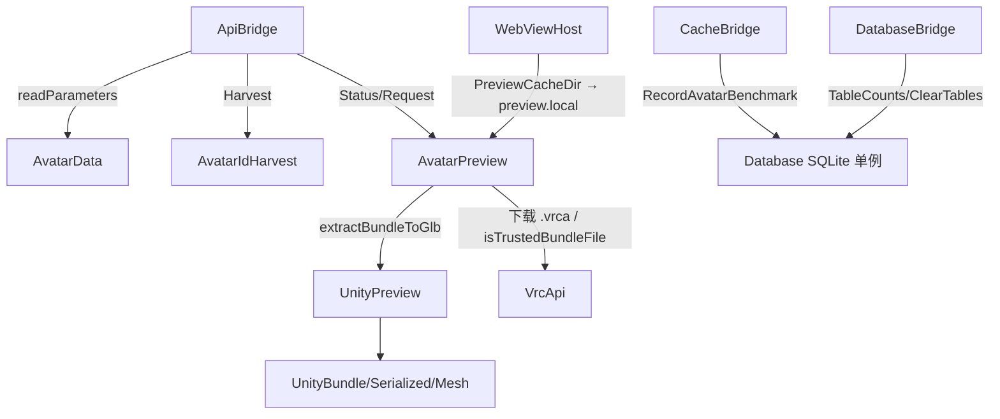

# 核心：头像预览与数据库

> 上级：[核心子系统总览](README.md)　|　相关：[缓存与 Bundle](cache-and-bundle.md)、[编排层](orchestration.md)、[数据生命周期专章](../flows/data-cache-lifecycle.md)

本页覆盖 `AvatarData`、`AvatarIdHarvest`、`AvatarPreview`、`UnityPreview`、`Database`。



## 1. AvatarData —— 本地头像 JSON 扫描 / 参数解析

读取 `%LocalLow%\VRChat\VRChat\LocalAvatarData\<usr_*>\<avtr_*>`（无扩展名 JSON），产出头像清单与动画参数报告。零网络、零变更。

`readParameters()`（`AvatarData.cpp:246-352`）—— **双重防穿越**：

1. `LooksLikeId(avatarId,"avtr_")` 用正则 `^[A-Za-z0-9_-]+$` 拦非法字符（`:68-76`）—— 第一道闸。
2. 解析路径后再 `ensureWithinBase(root, target)` 二次确认落在 `LocalAvatarData` 内，否则 `path_escape`（`:305-308`）—— 第二道闸。

`scan()`（`:198-244`）：直方图统计 → 按 `modified_at` 降序 → 按 `avatar_id` 去重 → 上限截断 10000。解析异常仅 debug 日志不抛。

## 2. AvatarIdHarvest —— A10 只读 Amplitude 分析缓存 ID 抓取

VRChat 现已加密磁盘头像缓存，离线 `avtr_` id 富化改从客户端自写的 Amplitude 分析缓存 `%Temp%\VRChat\VRChat\amplitude.cache` 提取（VRC-LOG 手法）。**严格只读、无网络、无变更、无上传**；原始内容视为不透明 DATA，只用正则 `(avtr_[0-9a-fA-F-]+)` 抽取 id，`unordered_set` 去重（`AvatarIdHarvest.cpp:18/42`）。门控（默认 OFF）由前端负责。文件不存在/不可读返回空 vector，从不抛异常。

## 3. AvatarPreview —— 预览编排（bundle 定位 → glb 缓存）

v0.5.1 起完全在进程内驱动 3D 预览，取代旧的外部 Python `vrcsm_extractor.exe`。

### 缓存键 / 哈希

> [!NOTE] `stableHashHex`（`:532-555`）是 **FNV-1a 64 位**折叠成 40 hex 字符，注释明确"仅需稳定性、非加密强度"（`:528-531`）—— **不是真 SHA1**，尽管命名与 40 字符形似 sha1。

schema 常量 `kPreviewCacheSchema = "preview-v5"`（`:57`）。`CacheKeyForAvatarSource` = hash(`preview-v5|avatarId|sourceSig`)；GLB 落 `PreviewCacheDir()/<hash>.glb`。schema 变更即自然失效旧 GLB。

### 源解析级联顺序 `preparePreviewSource`（`:740-843`）

1. 调用方显式 `bundlePath` → `cacheSource="local-bundle"`。
2. **先** `resolveBundlePath`（LocalAvatarData + Cache-WindowsPlayer）→ `bundle-index`；**刻意在 assetUrl 之前**，确保离线/私有头像有本地缓存时绝不发网络请求（`:772-774` 注释）。
3. 无本地、有 `assetUrl`：`isTrustedBundleFile` 命中用 `bundle-cache`；`allowDownload=false` 时返回 `network` 不下载（供 `Status` 探针用）；否则下载 `.vrca`。
4. 均无 → `bundle_not_found`。

### GLB 缓存租约（LRU 保护）

`PreviewPathLease` RAII + `previewPathLeases` map。`release` 给 2 分钟宽限期避免陈旧 object URL 与清理竞态。`canonicalExistingPreviewGlbPath`（`:111-138`）拒绝 symlink、强制 `ensureWithinBase(cacheDir, ...)`。LRU 清理跳过 `.part` 与被租约路径，限额 bundles 4 GiB、glb 1.5 GiB。

### 线程 / 取消

`Request` 的 `TaskQueue&`+`TaskToken&` 版在每个阶段边界检查 `token.cancelled`，取消时删除半成品 GLB。GLB 写入用 `.part` + rename 原子发布。ApiBridge 侧还有 `m_previewShared` promise 合流去重。参见 [TaskQueue 文档](orchestration.md#3-taskqueue串行任务队列--job-object-子进程管理)。

## 4. UnityPreview —— 进程内 UnityFS → glTF 2.0 (.glb)

单一入口 `extractBundleToGlb(bundlePath, glbPath)`（`UnityPreview.cpp:683-771`）：`parseUnityBundle` → 遍历节点（`node.size >= 20` 才当 SerializedFile）→ 每个 class 43 Mesh `parseUnityMesh`（附 `StreamDataResolver` 解析 `.resS`）→ 空网格 `no_meshes` → `filterAdaptive` 自适应过滤 → `writeGlb`。UnityFS 解码细节见 [缓存与 Bundle 文档](cache-and-bundle.md#3-unity-反序列化链)。

**自适应过滤 `filterAdaptive`（`:145-353`，移植自 `extract_to_glb.py`）** 六阶段：偏好蒙皮 → 体积离群 → 空间质心离群 → LOD 去重 → 锚定身体簇+关键词拒绝 → 偏好无关键词干净集。最终截断至 `kMaxMeshesPerPreview=12`。

**GLB 写入 `writeGlb`（`:377-649`）**：手写最小 glTF 2.0（POSITION/NORMAL/TEXCOORD_0，V 翻转，索引统一 u32）。原子写 `.part` 再 rename。假设小端主机（注释"Windows x64 恒成立"）。

## 5. Database —— 单一持久 SQLite 存储

`%LocalAppData%\VRCSM\vrcsm.db` 单连接单例，进程启动由 IpcBridge 打开、关闭时拆除。所有公开方法线程安全 —— 单连接串行化在 `m_mutex` 后（`Database.h:542-544`）。无异常，全返回 `Result<T>`。

### 生命周期与 Schema

- `Open()`（`:896-996`）：首次注册 `sqlite3_vec_init` 为 auto-extension；`SQLITE_CORE` 宏使 sqlite-vec 静态链接；幂等（同路径 no-op，异路径报错，不支持热切换）；`busy_timeout=5000`；调 `InitSchema()`。
- **单事务包裹全部 DDL + 迁移**（`BEGIN` `:4935` … `COMMIT` `:5478`），任一步失败回滚，避免半升级。版本以 `PRAGMA user_version` 推进，当前到 **v18**。
- v17 引入 `avatar_benchmark`（**跨 VRChat 缓存驱逐持久化**，最新提交 8a972cd 主题）；v4 引入 embeddings 的 vec0 虚拟表 `avatar_embeddings_vec embedding float[512]`。

### 头像相关表

- `avatar_history`（`RecordAvatarSeen` `:1582`）：`ON CONFLICT(avatar_id) DO UPDATE`，`COALESCE`/`NULLIF` 愈合空值、保留首见时间戳。
- `avatar_benchmark`（`RecordAvatarBenchmark` `:1742`）：UPSERT，`parameter_count` 每次覆盖、`first_seen_at` 保留最早。查询按 `parameter_count DESC, last_seen_at DESC`。
- `avatar_embeddings`（实验视觉搜索）：`UpsertAvatarEmbedding`（`:5546`）单事务 upsert meta + 先删后插 vec0（vec0 不支持 ON CONFLICT）；`SearchAvatarEmbeddings` 用 `embedding MATCH ? AND k = ? ORDER BY distance`。

### data.usage / data.clear 目标（重点）

- `TableCounts`（`:3099-3152`）：遍历**编译期常量** `kUsageCountTables`（16 表），每表先探存在性再 `COUNT(*)`。表名来自编译期常量非调用方输入，拼接安全。
- `ClearTables`（`:3154-3240`）：**先**用 `isClearableTable`（19 表白名单）校验**整个**请求，任一未知名 → `db_invalid_argument` 且不执行任何删除（`:3166-3172`）—— **防 SQL 注入的核心闸门**；随后单事务内逐表 `DELETE FROM "<table>"`（白名单保证引号拼接安全）。

完整表结构、data.clear 前后端映射、以及三个页面内联 Clear 按钮的目标，见 [数据生命周期专章](../flows/data-cache-lifecycle.md)。

### 并发/生命周期风险点

所有公开方法首行 `std::lock_guard lock(m_mutex)`；单连接下事务不可重入 —— `RecordPlayerEvent` 等自行 `BEGIN/COMMIT`，若在已持锁方法内嵌套调用会导致 SQLite "cannot start a transaction within a transaction"（当前各调用点均为顶层，未见嵌套）。

## 关键 load-bearing 片段

`ClearTables` 注入防护（`Database.cpp:3166-3172`），白名单前置校验，未知表名整体中止：

```cpp
for (const auto& table : tables)
    if (!isClearableTable(table))
        return MakeError("db_invalid_argument", "Table not clearable: " + table);
```

## 待核实

- `typetree_unsupported` 错误码在 `UnityPreview.h:32` 声明并被 `AvatarPreview.cpp:1030` 保留，但 UnityPreview 主循环对 SerializedFile 解析失败是静默 `continue`（`:712-715`），**该码当前是否可达未验证**。
- vec0 `embedding float[512]` 维度硬编码（`Database.cpp:5036`），与注释的 CLIP ViT-B/32 512 维一致。

## 相关文件

- `src/core/AvatarData.{cpp,h}`、`AvatarIdHarvest.{cpp,h}`、`AvatarPreview.{cpp,h}`、`UnityPreview.{cpp,h}`、`Database.{cpp,h}`
- 宿主：`src/host/bridges/ApiBridge.cpp`、`CacheBridge.cpp`、`DatabaseBridge.cpp`、`WebViewHost.cpp`
