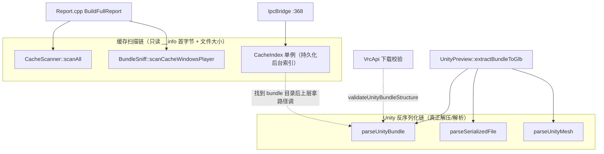

# 核心：缓存扫描链 + Unity 反序列化链

> 上级：[核心子系统总览](README.md)　|　相关：[安全删除/迁移](safedelete-migrate.md)、[头像预览/数据库](avatar-preview-db.md)、[数据生命周期专章](../flows/data-cache-lifecycle.md)

本页覆盖两条互不相交的职责链：**缓存扫描链**（统计磁盘占用、归纳 bundle 条目、维护 `avtr → bundle 目录` 索引）和 **Unity 反序列化链**（把 UnityFS bundle 逐层拆到 Mesh，供头像预览抽取网格）。

## 1. 两条链的边界

关键：两条链**没有互相调用**。缓存链从不解压 bundle；Unity 链才做真正的解压与结构解析。二者只在概念层交汇 —— `CacheIndex` 找到 bundle 目录后，由上层（`UnityPreview`）拿路径去调 `parseUnityBundle`。

## 2. 缓存扫描链

### 2.1 CacheScanner —— 目录分类统计

- 12 个固定分类定义在 `categoryDefs()`（`CacheScanner.cpp:32-49`），每条含 `key/name/rel_path/kind/safe_delete`。
- `scanAll`（`CacheScanner.cpp:155`）对每个分类各起一个 `std::async` 并行走目录（`:167-181`），避免 `HTTPCache`/`TextureCache` 这类巨型目录互相阻塞。
- **关键优化**：`cache_windows_player` 分类只做 `statCategory`（`:169-174`），跳过递归 walk。它的字节/mtime 由 `Report.cpp:54-80` 从 `BundleSniff` 聚合结果回填，省掉对磁盘最大目录的重复完整遍历。
- `scanDirectory`（`:61`）用 `skip_permission_denied` 且对每一步检查错误码（`:87-88`），遇错 break 而非抛异常 —— 与 core 无异常约定一致；同时检查 `is_symlink` 不跟随符号链接（`:73`）。

### 2.2 BundleSniff —— bundle 条目归纳

`scanCacheWindowsPlayer`（`BundleSniff.cpp:148`）是全流程单一最大开销点：

1. 枚举顶层 hash 目录进 `pending`（`:162-168`），跳过保留名 `__info`/`vrc-version`（`kReservedNames` `:42`，`isReserved` `:44`）。
2. 用 `min(pending.size(), hardware_concurrency())` 个线程 + `std::atomic<size_t> next` 做无锁工作窃取（`:176-227`），每线程对一个子树 `aggregate`（`:64`），顺带记录首个 `__data`/`__info` 路径。
3. 每条目读 `__info` 首行（资产 URL）填 `info_url`（`readFirstLine` `:101`，调用于 `:205`）。
4. 按字节数降序 `std::sort`（`:229`）。
5. **magic 回填只对前 16 名**（`kMagicLimit=16` `:237-246`）—— `readMagic`（`:114`）每次 fopen，对上千 bundle 全读是浪费；前端只在 `largest_entries`（Report 截断到 10）着色 UnityFS 徽章。其余条目 `bundle_format` 保持 `"unknown"`（`:214`）。

`classifyMagic`（`:139`）用 `rfind(...,0)==0` 前缀匹配识别 `UnityFS/UnityWeb/UnityRaw/UnityArchive`。`readMagic`（`:114`）只取开头连续可打印 ASCII（32–126），遇非打印字节即停 —— 对二进制 UnityFS 头是安全读法。`sniff`（`:256`）是单条目版本，供 `CacheBridge::HandleSniffBundle` 用。

### 2.3 CacheIndex —— 持久化后台索引（单例）

设计动机（`CacheIndex.h:15-31`）：旧的 `findBundleForAvatar` 暴力扫描且有 2000 文件硬上限，重度用户（50GB+、10000+ 条目）的深层 bundle 永远找不到。

- 单例 `Instance()`（`CacheIndex.cpp:73`），一进程一份，跨所有 IPC handler 共享。
- `StartScan`（`:88`）幂等：同路径且 `m_scanning || m_ready` 直接返回（`:92-95`）；换路径则先 `m_stopping=true` 并 join 旧线程（`:98-105`），`LoadPersisted()` 热启动后开新工作线程（`:116-119`）。
- `Lookup`（`:122`）O(1)，加锁查 `m_index`（`avtr_id → 路径`）。
- `ScanWorker`（`:231`）两级 walk `Cache-WindowsPlayer/<topHash>/<versionHash>/__info`（`:248-254`），每个 `__info`：大小 0 或 >16KB 跳过（`:269`），读入后用 `view.find("avtr_")` 循环抽取所有 41 字符 UUID（`:281-315`），内联校验 UUID 格式（连字符位 13/18/23/28）。首次命中即插入 `m_index`（`:307-312`）。
- 持久化到 `%LocalAppData%\VRCSM\cache-index.json`（`PersistPath` `:138`）：`SavePersisted`（`:195`）在锁内拷贝 map 再落盘；`LoadPersisted`（`:143`）只在 `cwpDir` 一致时加载（`:161`），并对每条走 `IsValidAvatarId`（`:19`）+ `IsUsablePersistedBundlePath`（`:45`）校验（目录存在、`ensureWithinBase` 防越界、`__data`/`__info` 至少存其一），脏条目跳过。

**线程/生命周期**：`m_mutex` 只保护 map 写入，后台扫描期间并发 `Lookup` 立即返回当前已建成的部分索引（优雅降级，不阻塞，`CacheIndex.h:28-31`）。`m_ready/m_scanning/m_stopping` 均为 `std::atomic<bool>`。

> [!WARNING] **文档与实现不符**：`CacheIndex.h:23` 注释承诺按根目录 mtime 检测过期条目，但 `ScanWorker` 实现中未见 mtime 比较逻辑。该机制状态 **unverified**（可能待实现或在他处）。注意这与 `docs/CACHE-ARCHITECTURE.md` 登记表中 `cache-index.json` 行「Stale when cache root mtime changes」的描述存在张力 —— 登记表描述的是**预期失效策略**，当前扫描器代码里未见对应实现。

## 3. Unity 反序列化链

三层剥离（bundle → SerializedFile → Mesh），每层各有 `ByteReader`/`MeshReader`，均基于"失败即置位 `m_failed`、后续读全返 0"的软失败模型，配合大量上界检查防御恶意/截断输入。

### 3.1 UnityBundle —— UnityFS 解包

`parseUnityBundle`（`UnityBundle.cpp:329`）全量载入 + 全块解压：

1. 文件大小校验：0 或 >2GiB 拒绝（`:333-340`）。
2. Header（**大端**）：签名必须 `UnityFS`（`:362`），formatVersion 必须 6–8（`:369`），读版本串、`totalSize`/`compressedInfoSize`/`uncompressedInfoSize`/`flags`（`:378-381`）。
3. `uncompressedInfoSize` 上限 `kMaxBlocksInfoSize=64MiB`（`:26`，检查 `:393`）—— 防伪造 header 索要巨额解压分配。
4. flags 位语义（`:398-411`）：`0x3F` 压缩类型、`0x80` blocksInfo 在文件尾、`0x200` 块数据需 16 字节对齐、`0x400` **VRChat 自定义加密 → 直接返回 `Error{encrypted}`**（`:413-416`）。
5. `decompressBlock`（`:158`）支持 None/LZ4/LZ4HC/LZMA。**LZMA 特殊处理**（`:195-261`）：Unity 存 5 字节 props + 裸 LZMA1 流，用 `lzma_raw_decoder`；坑点注释在 `:208-215` —— 必须用 `lzma_properties_decode` 自行分配的 options 而非栈上零初始化结构，否则每个真实流都 `LZMA_DATA_ERROR`。
6. blocksInfo 内逐块/逐 node 解析，各种 count 上限 0x10000、`totalUncompressed` 上限 2GiB（`:455-500`）。
7. 逐块 `decompressBlockInto`（`:268`）拼接连续解压流，校验总量与每个 node 范围不越界（`:537-579`）。

`validateUnityBundleStructure`（`:592`）是**下载缓存边界的轻量校验**（供 `VrcApi.cpp:1461` 下载完成校验用）：解析 header/blocksInfo/block 表/node 表并验证范围，但**不物化整个 bundle**，专抓"以 UnityFS 开头但被截断"的坏下载，比 `parseUnityBundle` 多几处早期严格检查（`:642/:646/:717`）。

### 3.2 UnitySerialized —— SerializedFile

`parseSerializedFile`（`UnitySerialized.cpp:172`）只解码定位 Mesh 所需的元数据表，**故意不解析 TypeTree**（`UnitySerialized.h:24-28`：VRChat bundle `TypeTreeEnabled==false`，直接按 Unity 2022.3 字段布局硬解码）。

- 支持格式版本 17–22（`:20-21`，检查 `:208`），覆盖 Unity 2019.4–2022.3 LTS。
- **Header 恒大端**（`:184-206`）；v9+ 读 `endianness` 字节决定其余字节序（`:215-219`）；v22+ 追加 u64 fileSize/dataOffset（`:224-230`）。
- 依次解析 unityRevision/targetPlatform/typeTreeEnabled/Types 表/Objects 表/脚本类型表/Externals（版本门控，`:259-527`）。
- 全部大小有上限：type 1M / object 16M / external 64K（`:16-18`）。收尾对每个 object 校验 `dataOffset+byteStart+byteSize` 不越界（`:529-542`）返回 `sf_obj_oob`。类 ID 常量见 `UnitySerialized.h:35-44`（Mesh=43）。

### 3.3 UnityMesh —— Mesh（class 43）硬解码

`parseUnityMesh`（`UnityMesh.cpp:400`）只抽取预览需要的属性：positions/normals/UV0 + 每 submesh 索引区间 + AABB；tangents/colors/skin weights 全丢弃（`UnityMesh.h:19-27`）。

- 版本从 unityRevision 解析 `major.minor`（`:198`），`<5` 拒绝（`:408`）。
- **`m_MeshCompression != 0` 直接返回 `Error{mesh_compressed}`**（`:489-494`）—— 只支持未压缩。
- **StreamingInfo**（2018.2+ `:563-580`）：若顶点数据在外部 `.resS`，通过 `StreamDataResolver` 回调解析（`:592-608`）；无 resolver 则 `Error{mesh_streamed_no_resolver}`。resolver 由 `UnityPreview.cpp:701` 提供。
- 顶点解码（`:616-708`）按 channel 的 `kFormatBpc` 表（`:24-37`）解出 Position/Normal/UV0；缺 Position 返回 `mesh_no_positions`（`:684-688`）。索引统一 widen 到 u32（`:710-737`）。

## 4. 错误路径与安全性

- **统一软失败**：三个 reader 都不抛异常，越界读置 `m_failed` 后返回 0；每个解析函数在关键点返回带机读 code 的 `Error`（`bundle_invalid`/`sf_obj_oob`/`mesh_compressed`/`encrypted`）。UnityPreview 遍历时对单个坏 node/mesh 只 `continue` 跳过（`UnityPreview.cpp:713-731`）。
- **抗恶意输入的上界**遍布全链（blocksInfo 64MiB、解压总量 2GiB、各 count 0x10000、type/object/external 1M/16M/64K、bundle 文件 2GiB），防"伪造 header 索要巨额分配"（`UnityBundle.cpp:23-26`、`UnitySerialized.cpp:14-18`）。
- **加密拒绝**：UnityFS `0x400` 标志直接返回 `Error{encrypted}`（`UnityBundle.cpp:413/:660`），不尝试解密。
- **路径越界防护**：`CacheIndex` 加载持久化条目走 `ensureWithinBase`（`CacheIndex.cpp:60`）；`CacheBridge::HandleSniffBundle` 定位 versionDir 同样 `ensureWithinBase`（`CacheBridge.cpp:141`）。

## 相关文件

- `src/core/CacheScanner.cpp` / `.h`、`CacheIndex.cpp` / `.h`、`BundleSniff.cpp` / `.h`
- `src/core/UnityBundle.cpp` / `.h`、`UnitySerialized.cpp` / `.h`、`UnityMesh.cpp` / `.h`
- 上游消费者：`Report.cpp:37-48`、`UnityPreview.cpp:683-735`、`VrcApi.cpp:1461/2111`、`src/host/bridges/CacheBridge.cpp:159`、`src/host/IpcBridge.cpp:368`
