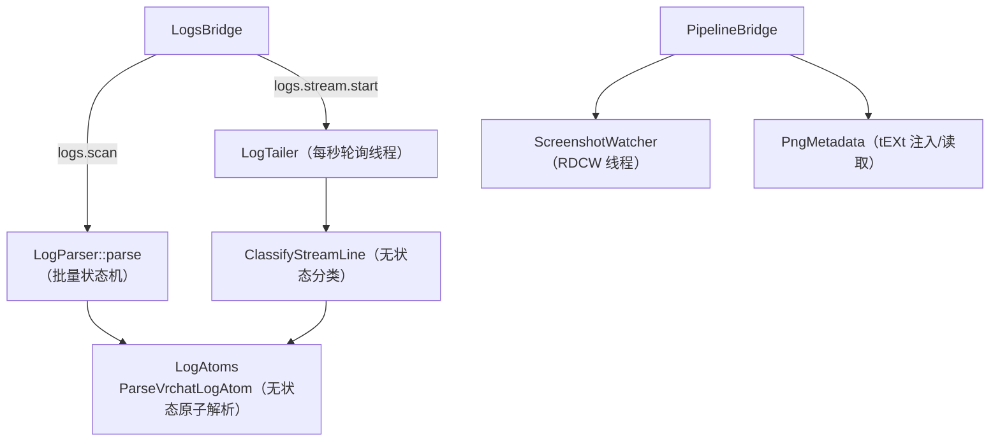

# 核心：日志解析管线

> 上级：[核心子系统总览](README.md)　|　相关：[编排层](orchestration.md)、[数据生命周期专章](../flows/data-cache-lifecycle.md)

本页覆盖把 VRChat 客户端写出的 `output_log_*.txt` 转成结构化事件的管线，供前端 Logs 页与 Radar/Report 使用。管线分两条路径，共用同一套无状态原子解析器。

## 1. 目标与两条路径

- **批量路径**（冷扫描历史）：`LogParser::parse` → 一次性读取最新若干日志文件，产出一个 `LogReport`（`LogParser.cpp:1278`）。
- **实时路径**（跟随新行）：`LogTailer`（后台线程轮询新字节）→ `ClassifyStreamLine`（逐行分类，`LogEventClassifier.cpp:206`）→ 经 IPC 推送 `logs.stream` / `logs.stream.event`。

两条路径都调用共享的 `ParseVrchatLogAtom`（`LogAtoms.cpp:269`），因此批量报表与实时流在事件格式上不会分歧（`LogParser.cpp:823-825` 注释）。

## 2. 原子解析层（LogAtoms）—— 管线核心

### 行前缀解析 `ParseVrchatLogLine`（`LogAtoms.cpp:218`）

VRChat 每行前缀形如 `YYYY.MM.DD HH:MM:SS  Log|Warning|Error  -  <body>`，由 `kLinePrefixRe`（`:13`）匹配。产出 `ParsedLogLine{body, level, iso_time, has_prefix}`（`LogAtoms.h:11`）。无前缀的续行（异常栈）整行作为 `body` 返回、`has_prefix=false`（`:249`）。

### 原子分类 `ParseVrchatLogAtom`（`LogAtoms.cpp:269`）

剥前缀取 `body`，随后一串 `std::regex_search` 顺序匹配，命中第一个即返回 `LogAtom{kind, params}`。这是**有意无状态**的（`LogAtoms.h:69-71`）：只用当前行本身，跨行关联留给批量调用方。`LogAtomKind` 枚举（`LogAtoms.h:19-50`）共 28 种，覆盖身份/世界/头像、玩家/媒体、以及 Wave-2 的通知/视频/会话模式等。

关键正则陷阱（都在 `LogAtoms.cpp` 顶部匿名命名空间）：

- 玩家行 `(usr_…)` 可选（`:27-30`）—— 老客户端不带 id。无 id 时对显示名做 `NormalizeVrchatDisplayName` 去哈希（`:357-359`）。
- Sticker 行顺序是**反的**：先 `usr_` 后 `(显示名)`（`:56-58`）。
- SessionMode 三选一正则区分 VR/Desktop（`:86-87`）。
- `AppQuit` 兼容 2024.10.23 改名前后的 `OnApplicationQuit`/`HandleApplicationQuit`（`:81-84`）。

### 实例后缀解析 `putWorldInstanceParams`（`LogAtoms.cpp:133`）

把 `wrld_xxx:12345~private(usr_…)~region(jp)~canRequestInvite` 拆成 `world_id / instance_id / instance_number / access_type / owner_id / region / can_request_invite`。`access_type` 默认 `public`，各 `~private/friends/hidden/group` 映射（`:144-168`）。

### 显示名归一

`NormalizeVrchatDisplayName`（`:253`）/ `stripUnresolvedHashSuffix`（`LogParser.cpp:1249`）两处实现等价：迭代式 `regex_replace` 剥 `_XXXX` 后缀与尾部 hex。仅在日志行没带 `usr_` id 时使用（非好友/被限流时 VRChat 追加哈希后缀）。

## 3. 批量状态机（LogParser）

`LogParser::parse`（`:1278`）：

1. `findLogFiles`（`:403`）枚举 `output_log_*.txt`，按名降序取最新 `kMaxLogFiles=20`（`:335`），再 `std::reverse` 使处理顺序变成**从旧到新**（`:428-429`），保证跨文件时序正确。
2. 每文件开始重置**每文件瞬态**（pending world/avatar、section、`lastTimestamp`），防上个文件半成对状态泄漏（`:1299-1305`）。
3. 每行进 `parseLine`（`:1217`）：先粘性抓时间戳（续行继承上一锚点时间），再按 `BlockState`（Normal/Environment/Settings）分派。

### 关键跨行状态与配对链

- `playerNameToUserId`：从 join 行建 名字→usr_ 映射，**每次 WorldInstance 切换时清空**（`:565`，显示名只在实例内唯一）。
- **头像名字→id 绑定链**：`Switching <me> to avatar <name>`（设 `pendingLocalAvatarName`）→ `Unpacking Avatar (<name> by <author>)`（补 author）→ `Loading Avatar Data:avtr_xxx`（绑定 name+author 到 id）。绑定后**立即清空 pending**（`:1061`），这是修复"5 个不同头像都叫 Runa"泄漏 bug 的关键（`:1056-1060`）。

### 上限保护

`kMaxEventsPerKind=2000`（`:341`）每流封顶；`kMaxRecentIds=1000`（`:336`）结尾截断。

> [!NOTE] `to_json(LogSettingsSection)`（`LogParser.cpp:67`）刻意用 `json::array({k,v})` 发**元组**而非对象 —— 注释记录了曾因 nlohmann 把 `{{"key",k}...}` 误判为对象导致前端整卡空白的 bug（`:69-76`）。改动 Settings 块序列化时勿回退。

## 4. 实时跟随（LogTailer）

`LogTailer` 模仿 VRCX 的 `LogWatcher.cs`：后台线程每秒轮询（`kPollInterval=1000ms` `:20`），**不用 FileSystemWatcher** —— VRChat 缓冲写日志，变更通知在 flush 时才触发，会漏事件、在轮转时产生幻影（`LogTailer.h:44-48`）。

关键行为：

- **共享打开**：`OpenShared`（`:27`）用 `FILE_SHARE_READ|WRITE|DELETE`，否则会因 VRChat 持有写句柄而每次 open 失败。
- **首附着 seek 到 EOF**（`OnFileSwitched` `:136`）：首次只看"打开面板后的新行"，历史交给批量 `LogParser`；后续轮转从 byte 0 开始（`m_attachedOnce` `:143-156`）。
- **半行处理**：`ReadNewBytes`（`:168`）按 `\n` 切，最后无换行段留到下轮（`kMaxCarryoverBytes=1MB` 防御性上限 `:24`）。
- **截断检测**：`size < m_offset` 说明 VRChat 崩溃后重写而非轮转，重置到 byte 0（`:182-188`）。
- `EmitLine`（`:249`）回调包在 try/catch 里 —— 回调抛异常不能拖垮 tailer 线程（`:269-277`）。

`ClassifyStreamLine`（`LogEventClassifier.cpp:206`）无状态地按 `atom->kind` 产出 `{kind, data}` JSON。因此 `AvatarSwitchEvent` 这里**不带** `actor_user_id`（`:30-37`），world/instance 由 LogsBridge 事后补（`LogsBridge.cpp:212-219`）。

## 5. 截图与 PNG 元数据

### ScreenshotWatcher（`ScreenshotWatcher.cpp`）

`ReadDirectoryChangesW` 递归监听（`bWatchSubtree=TRUE` `:163`）默认目录 `%Pictures%\VRChat`（`:65`）。只认 `.png`（`:46`）。**去重**：10 秒窗口滤重复 CREATE/LAST_WRITE（`:144-154`）；命中后 `sleep 250ms` 再回调，给 VRChat 写完大帧余量（`:203-207`）。`Stop`（`:114`）靠 `CancelIoEx`+`CloseHandle` 解阻塞后 join。

### PngMetadata（`PngMetadata.cpp`）

向 PNG 注入 VRCX 风格 `tEXt` 块。CRC32 标准多项式 `0xEDB88320`。`InjectPngTextChunks`（`:172`）校验 8 字节签名 + 首块 IHDR，把 tEXt 插在 IHDR 之后。**原子写**：`WriteFileBytesAtomic`（`:131`）先写 `.vrcsm-part` 再 rename —— 部分写只会留孤儿 .part，绝不损坏用户原截图（`:134-137`）。`ReadPngTextChunks`（`:245`）逐块解析，恶意/畸形输入返回空 vector。

## 6. 线程/生命周期与安全

- **线程模型**：`LogTailer` 与 `ScreenshotWatcher` 各持一条后台线程，`std::atomic<bool>` 控运行/停止；tailer 用 `condition_variable` 让 `Stop` 立即打断 1 秒等待。`Stop()` 同步 join，析构安全。
- **回调越界防护**：tailer 回调捕获 `alive = m_alive`（shared_ptr 拷贝），拆除窗口内先查 `alive->load()` 再触碰成员（`LogsBridge.cpp:172-182`）；LogsBridge 用互斥 + 引用计数管理多订阅者的 tailer 单实例（`:86-90`、`:490-498`）。
- **外部数据即不可信**：所有日志行/PNG 字节都当不可信内容 —— 正则匹配 + 长度封顶（Udon 异常消息截断 200 字符、tEXt 值封顶 64KiB、carryover 封顶 1MB、事件流封顶 2000）。这些上限共同防畸形/超长日志撑爆 IPC 载荷或内存。
- **只读用户数据**：唯一写操作是 PNG 元数据注入，走 .part 原子替换。本区不接触 token/session；`usr_`/`avtr_` id 是日志内容按原样解析，非机密凭据。

## 相关文件

- `src/core/LogAtoms.{h,cpp}`（无状态原子解析器，两路径共用）
- `src/core/LogParser.{h,cpp}`（批量状态机 + 事件结构 + `to_json`）
- `src/core/LogTailer.{h,cpp}`、`LogEventClassifier.{h,cpp}`
- `src/core/ScreenshotWatcher.{h,cpp}`、`PngMetadata.{h,cpp}`
- 消费者：`src/host/bridges/LogsBridge.cpp`、`PipelineBridge.cpp`、`src/host/IpcBridge.h:354`

**未验证项**：`tests/CommonTests.cpp`、`tools/dump_logs`、`tools/tail_probe` 引用了这些 API 但未逐一核对断言内容。
