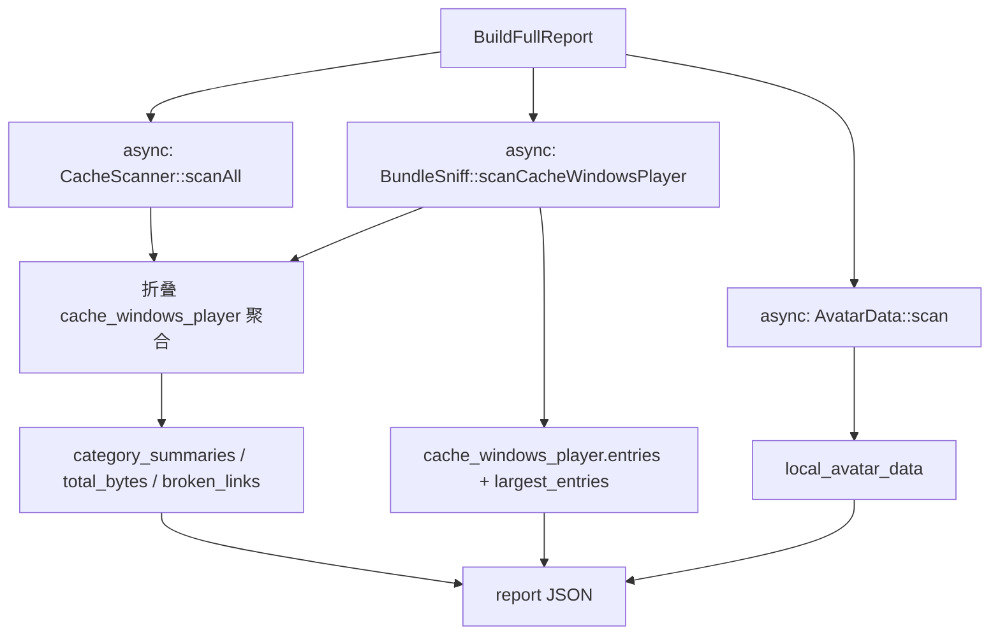

# 核心：编排与基础设施

> 上级：[核心子系统总览](README.md)　|　相关：[头像预览/数据库](avatar-preview-db.md)、[实时集成](realtime-integrations.md)、[IPC 往返链路](../flows/ipc-roundtrip.md)

本页覆盖编排与基础设施模块：`Report`、`Pipeline` 类、`TaskQueue`、`ProcessGuard`、`ProcessMemoryReader`、`Common`。

> [!IMPORTANT] 命名澄清见 [架构文档 §5](../01-architecture.md#5-命名澄清重要)。本页有两个 "Pipeline"：**报告聚合**（`Report.cpp`）和 **`Pipeline` 类**（实时事件 WebSocket），二者无关。

## 1. 报告聚合流水线（Report.cpp）

前端 `scan` IPC → `CacheScanner::buildReport` → `Report.cpp` 的 `BuildFullReport`。转发层刻意存在（`Report.h:12-19`）：`buildReport` 声明在 `CacheScanner.h`，实现放 `Report.cpp`，让聚合代码能 include 所有扫描器头文件而不污染 `CacheScanner` 翻译单元。

带参重载 `BuildFullReport(baseDir, parsedLogs)` 让 `HandleScan` 复用已为 DB 回填解析过的日志，避免二次冷读同一批 `output_log_*.txt`（`Report.cpp:33-35`）。

### 并行扇出

三个 `std::async(std::launch::async)`（`Report.cpp:37-45`），主调用线程随后 `.get()` 阻塞收集。**CWP 折叠**（`:54-80`）：`scanAll` 故意跳过 `Cache-WindowsPlayer` 全量递归（逐文件统计已由 `BundleSniff` 得到），折叠时遍历 cwpEntries 累加回填。**broken_links**（`:95-124`）：对每个是 reparse point 的分类路径 `readJunctionTarget`，目标不存在则记一条。

报告聚合几乎不返回错误 —— 它返回裸 `nlohmann::json`，异常安全依赖底层扫描器不抛（junction 检测用 `error_code`）。数据模型 schema 见 [数据生命周期专章](../flows/data-cache-lifecycle.md)。

## 2. Pipeline 类：VRChat 实时事件 WebSocket

连 `wss://pipeline.vrchat.cloud/?auth=<短期token>`，实时推送好友在线翻转、加/删好友、通知、self user-update（`Pipeline.h:15-30`）。基于 WinHTTP 原生 WebSocket，不引第三方库。

### 线程与生命周期

- 单后台 worker 线程，`Start` 用 `m_running.exchange(true)` 幂等（`:106-118`）。
- `Stop()`（`:120-155`）：`exchange(false)` 幂等；置 `m_wakeFlag`+`notify_all` 打断退避 sleep；**关键** —— 在 `m_activeSocketMutex` 下取出并置空 `m_activeSocket`，`WinHttpWebSocketClose`+`CloseHandle` 强制中断可能永久阻塞的 `WinHttpWebSocketReceive`，否则 join 会挂死（`:133-147`）。
- Socket 句柄所有权转移（`:339-362`）：`RunOneConnection` 把升级完成的 socket `release` 出 RAII wrapper 存入 `m_activeSocket`，用 `ScopedSocketReclaim` 在连接结束时原子回收。

### 控制流与重连

- 无 session 时每 30s 重试（`:176-185`）。
- token 一次性，每次重连重新 `fetchPipelineToken()` —— 裸 session cookie 会被拒，必须用 `GET /auth` 的短期 WS token（`:187-190`；query key 是 `auth`）。
- 事件信封 `{type, content}`，`content` 是被 stringify 的 JSON，在此解析一次，失败则原样保留字符串（`:442-461`）。回调 try/catch 包裹，抛异常只 warn。日志中不打印 token 明文。

> [!WARNING] **文档/实现不一致**：`Pipeline.h:29-30` 与 `.cpp:30-31` 声称指数退避 5s→10s→30s→60s，但正常断连实际是**扁平 5s**（`Pipeline.cpp:211-216`，注释承认抄 VRCX）；只有 auth 失败(60s)和 token 失败(10s)差异化。头文件注释过时，若据此写用户文档会失真。

宿主侧封装见 `PipelineBridge.cpp`：`Pipeline` 作为 `IpcBridge` 成员懒创建，事件经 `PostEventToUi("pipeline.event", ...)` 转发到 UI，并按用户开关触发本地 toast。详见 [实时集成文档](realtime-integrations.md)。

## 3. TaskQueue：串行任务队列 + Job Object 子进程管理

串行（并发度 1）任务队列，专为 avatar 预览提取这类 CPU/磁盘密集任务设计（`TaskQueue.h:51-64`）。核心思想：并行 N 个只会让 N 个都变慢；串行 + 取消让用户最后点击的那个最快出结果。

### 线程模型与取消（"rapid click" 防御）

- 构造时创建 Job Object 并设 `JOB_OBJECT_LIMIT_KILL_ON_JOB_CLOSE`，保证进程退出（含崩溃）时强杀所有子进程，防孤儿 PyInstaller 进程（`TaskQueue.cpp:13-31`）。
- `Submit`（`:58-103`）：同 `key` 的在飞任务置 `cancelled`（`:71-75`），队列中同 `key` 的 drain 掉并回调 `"cancelled"`，再 push 新任务。注释：10 次点击 = 9 取消 + 1 真跑。
- `WorkerLoop`（`:141-202`）：`work` 用 try/catch(...) 包裹，异常转 `TaskResult{ok=false, error}`。

### 子进程执行 `SpawnAndWait`（`:204-305`）

用 `CREATE_SUSPENDED` 创建，**先 `AssignProcessToJobObject` 再 `ResumeThread`**，确保子进程无法在被纳管前逃逸（`:255/:266-271`）。500ms 轮询 `WaitForSingleObject`；`token.cancelled` 则 `TerminateProcess` 并等 2s 回收。

消费者 `ApiBridge.cpp` 的 `HandleAvatarPreview` 以 avatarId 为 key，另有一层 `m_previewShared`（avatarId → `shared_future`）做**同 id 并发去重**。两套互补：shared_future 合并同 id 并发，TaskQueue key 取消撤销不同批次的旧调用。详见 [头像预览文档](avatar-preview-db.md)。

## 4. ProcessGuard：VRChat 进程守卫

- `IsVRChatRunning()`（`:77-82`）：先查 `VRChat.exe`，再查 `VRChat-Win64-Shipping.exe`。CLAUDE.md 硬约束 —— 迁移/删除前必须检测。
- **后台 watcher**（`StartWatcher`/`StopWatcher`）：单全局线程每秒轮询（10×100ms 以便快速响应 stop），仅在状态**转变**时触发回调。取代旧的前端每 5s 轮询 IPC，检测延迟约 1s（`ProcessGuard.h:29-37`）。
- 宿主接线：`IpcBridge` 构造末尾 `StartWatcher`，VRChat 停止时 `CloseTrackedWorldVisits` 并 `PostMessageToWeb("process.vrcStatusChanged")`（`IpcBridge.cpp:371-386`）。

## 5. ProcessMemoryReader：VRChat 内存读取

雷达功能的底座。`Attach` 以最小权限 `PROCESS_VM_READ | PROCESS_QUERY_INFORMATION` 打开进程，**注释明说是为降低反作弊/AV 标记**（`ProcessMemoryReader.cpp:44-45`）。读原语：`ReadMemory`（要求整量读满）、模板 `Read<T>`、`ReadPointerChain`（任一环失败返回 nullopt）、`ReadString`（256 字节分块读到 NUL）。

安全注记：这是对本机运行的 VRChat 做**只读**内存读取（雷达/存在感知），非注入、非篡改；最小权限打开是刻意的规避反作弊选择。上层用法见 [实时集成文档](realtime-integrations.md)。

## 6. Common 基础设施

见 [核心总览的公共原语小节](README.md#贯穿核心的公共原语commonh--commoncpp)。关键点重述：`Result<T>`/`Error` 无异常模型、`ensureWithinBase` 路径守门（刻意避开 `weakly_canonical`）、`secureClearString` 按 capacity 清零、`nowIso` 产出**本地时间**非 UTC。

## 关键发现（需注意）

1. **`Pipeline` 重连退避文档/实现不一致**（见上文 warning）。
2. **`nowIso`/`isoTimestamp` 产出本地时间**（带时区偏移），报告 `generated_at`、DB 回填时间戳都是本地时区。
3. **两套并发去重机制并存**：`ApiBridge` 的 `m_previewShared` + `TaskQueue` 的 key 取消。
4. **子进程逃逸防护完整**：`CREATE_SUSPENDED` → `AssignProcessToJobObject` → `ResumeThread` + `KILL_ON_JOB_CLOSE`。

## 相关文件

- `src/core/Report.{cpp,h}`、`Pipeline.{cpp,h}`、`TaskQueue.{cpp,h}`、`ProcessGuard.{cpp,h}`、`ProcessMemoryReader.{cpp,h}`、`Common.{h,cpp}`、`CacheScanner.h`
- 消费者：`src/host/bridges/CacheBridge.cpp`、`ApiBridge.cpp`、`PipelineBridge.cpp`、`RadarBridge.cpp`、`ShellBridge.cpp`、`LogsBridge.cpp`、`src/host/IpcBridge.cpp`
