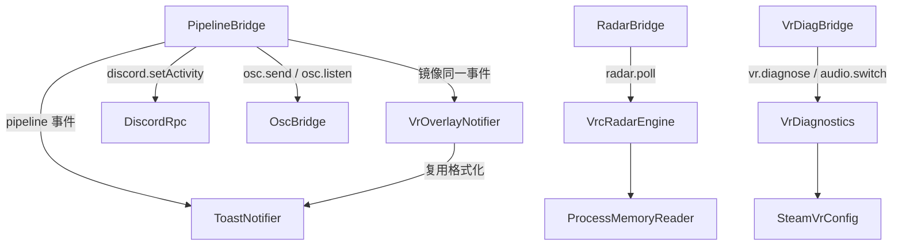
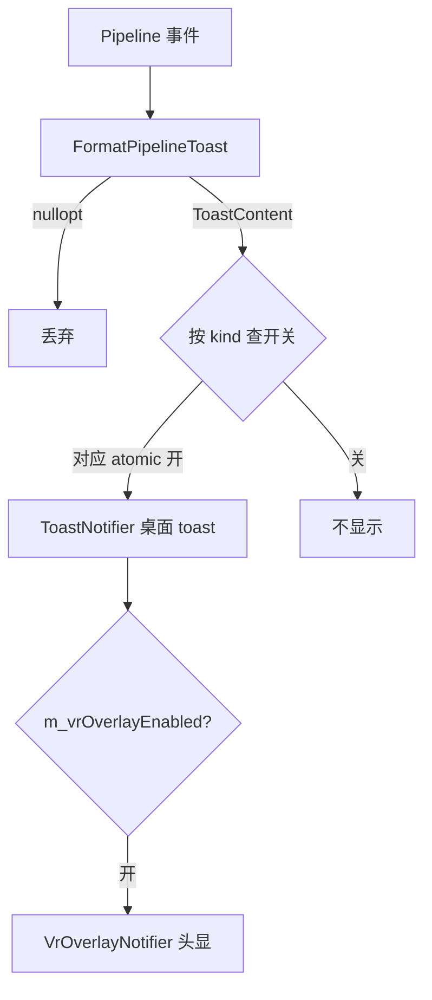

# 核心：实时与外部集成层

> 上级：[核心子系统总览](README.md)　|　相关：[编排层](orchestration.md)、[宿主 + IPC bridge](../02-host-ipc-bridge.md)

本页覆盖 `VrcRadarEngine`、`OscBridge`、`DiscordRpc`、`VrDiagnostics`、`VrOverlayNotifier`、`ToastNotifier` 及其宿主接入。共同设计姿态是 **fire-and-forget**：除 `VrDiagnostics` 返回 `Result<T>` 外，其余模块的失败都被吞掉并记日志。

## 1. VrcRadarEngine —— 内存雷达

只读地轮询 VRChat.exe 进程内存，提取当前实例内玩家列表。头注释明确 "Completely read-only"（`VrcRadarEngine.h:40-42`）。

IL2CPP 解析靠**运行时字符串扫描**而非硬编码类地址：`FindVRCPlayerTypeInfo`（`VrcRadarEngine.cpp:159-218`）在 1 GiB 范围扫描 ASCII `"VRCPlayer\0"`，命中后反推 TypeInfo 并缓存。玩家扫描（`TryReadPlayerList` `:234-311`）在 256MiB..16GiB 范围以 8 字节步进查找 klass 指针。

### 线程与生命周期（本模块最关键的安全设计）

`pollMutex_`（`VrcRadarEngine.h:86`）序列化整个 attach→scan→detach 序列。`PollOnce()` 会被三个线程并发触及：IPC 线程池（`radar.poll` 异步）、ScreenshotWatcher 回调线程、内部 `PollLoop`。若无此锁，一个线程的 `Detach()`（CloseHandle）会与另一个线程的 `Attach()`/`ReadProcessMemory` 竞争，可能双重关闭被 OS 复用的句柄（`:81-85`）。`Stop()`（`:94-106`）先 `running_=false` join 轮询线程，再取 `pollMutex_` 对齐在途 `PollOnce()`。

> [!WARNING] **IL2CPP 偏移脆弱性**：`kVRCPlayer_*` 字段偏移硬编码、注释自承认经验值（`VrcRadarEngine.cpp:50-58`），VRChat/Unity 更新可能破坏玩家解析。TypeInfo 定位用字符串扫描相对稳健，但字段读取不是。此外 `RadarPlayer::posX/Y/Z` 与 `RadarSnapshot::instanceId/worldId` 声明了但**从未填充**（`:285-342`）—— 前端若依赖会拿到默认值 0。

## 2. OscBridge —— VRChat OSC 的 UDP 客户端 + 服务器

最小 OSC 1.0：`Send()` 向 VRChat 输入口（默认 `127.0.0.1:9000`）发消息，`StartListen()` 在端口（默认 9001）起监听线程解码 VRChat 镜像出的参数更新。

- 编解码纯函数可单测：`EncodeOscMessage`（`:105-173`）、`ParseOscMessage`（`:175-244`，每步做 `offset+N > size` 边界检查）。
- **监听严格 bind `127.0.0.1`**（`:400`，仅回环，无外部入站面）。发送默认回环，host 可由前端指定但受 `inet_pton` 校验为合法 IPv4。
- `StartListen`/`StopListen` 幂等，`m_socketMutex` 保护 socket，回调 try/catch。

> [!NOTE] `ParseOscMessage` 对未知类型标签保守返回 false（`:237-241`），与头注释 "preserve unknown tags"（`OscBridge.h:44`）略有出入 —— 实际实现是拒绝而非保留。

## 3. DiscordRpc —— 命名管道 Rich Presence

通过本地命名管道 `\\.\pipe\discord-ipc-N`（N=0..9）连 Discord RPC 网关，v1 握手后推送 SET_ACTIVITY 帧。纯装饰性、fire-and-forget，每 30s 重试。

**关键：空 client_id 默认**。`kDiscordPlaceholderClientId = ""`（`DiscordRpc.h:26`），刻意不烧入真实 snowflake，避免在用户 Discord 显示错误应用。空 id 使 `TryConnect` 直接返回 false（`:217-220`），功能"暗置"。宿主侧 `EffectiveDiscordClientId`（`PipelineBridge.cpp:248-255`）优先用用户传入 id，否则空则 `discord.setActivity` 抛 `discord_not_configured`。

线程：`Start` 幂等，`WorkerLoop` 外层重连循环（失败 `wait_for(30s)` 可被 Stop 打断），内层 `SendActivityIfDirty` + `wait_for(15s)`。帧大小双向受 `kMaxFrame=64KB` 限制。`m_pipe` 用 `void*` 存 HANDLE 以避免头文件引入 Windows.h。

## 4. VrDiagnostics —— 诊断 + Steam Link 修复

`RunDiagnostics` 汇总网络适配器、SteamVR 配置、GPU（DXGI）、音频设备、vrlink 日志错误。**HMD 信息来源是解析 `steamvr.vrsettings` 文件，而非 OpenVR 运行时 API**（全文件未见 `vr::`/OpenVR 链接）。

### 安全核心：Steam Link 修复的路径白名单

`RepairSteamLink`（`:1576+`）所有目标路径都从注册表探测的 `SteamVrConfig::DetectSteamPath()` 派生，Steam 未找到即 `steam_not_found`。两个白名单守卫防路径穿越：

- `IsSteamLinkRestoreTargetAllowed`（`:1171-1217`）：target 必须绝对路径且**精确匹配**一组允许的 steam 子路径，匹配用 `SamePathLexical`。
- `IsSteamLinkBackupSourceAllowed`（`:1219-1238`）：source 在 backupDir 之内；`requireCanonical` 时额外用 `weakly_canonical` 解析符号链接后再验，防经链接逃逸。

修复前备份、`dryRun` 默认 true（`:1579`）、破坏性操作有精确白名单 —— 遵守 CLAUDE.md 破坏性防护原则。

## 5. VrOverlayNotifier —— 头显内 SteamVR 覆盖层通知（XSOverlay）

向 XSOverlay Notifications API（`127.0.0.1:42069` UDP）发 JSON。头注释强调**只向回环发送、从不开监听**（`VrOverlayNotifier.h:19-21`）。`FormatOverlayNotification`（`:41-58`）**复用** `FormatPipelineToast`（ToastNotifier 的纯函数），保证桌面 toast 与 VR 覆盖层用相同的不可信内容校验。纯出站回环 UDP，无监听面。

## 6. ToastNotifier —— 未打包 Win32 应用的原生 Toast

通过 WinRT `Windows.UI.Notifications` 为**未打包**应用显示原生 toast。未打包应用无包标识，需三步：进程启动 `SetCurrentProcessExplicitAppUserModelID`、开始菜单带同 AUMID 的 .lnk、`CreateToastNotifierWithId(AUMID)`。

- **纯格式化 `FormatPipelineToast`（`:204-297`）**：把 content 当**不可信数据**，每次访问都校验类型。此函数**不查用户开关** —— 调用方按返回的 `kind` 自行门控。
- **`XmlEscape`（`:161-178`）**：转义 `& < > " '` —— 防 XML 注入，是本模块主要安全点。

## 7. 跨模块联动：Pipeline 事件 → 三通道通知

`PipelineBridge.cpp:61-108` 的 Pipeline 事件回调（运行在 socket 线程）是汇聚点：

关键点：VR 覆盖层是**从属于**桌面开关的二级门（只有桌面 enabled 分支内才检查 `m_vrOverlayEnabled`，`:86-100`）。开关是 `std::atomic<bool>`（回调在 socket 线程跑）。前端经 `notify.setPrefs` 推送；缺失字段保持原值，默认全 OFF。

## 8. 横切安全观察

- **回环边界一致**：OSC 监听 bind 127.0.0.1，VrOverlay/Toast 无监听，Discord 用本地命名管道，Radar 只读内存。整个区无对外网络暴露面。唯一可由前端指定非回环目标的是 `osc.send` 的 `host`（受 IPv4 校验）。
- **fire-and-forget 一致性**：Discord/Toast/Overlay/Radar 全部吞错记日志；只有 VrDiagnostics 走 `Result<T>` 并把破坏性 Steam Link 修复用白名单+dryRun+canonical 校验护栏。

## 相关文件

- `src/core/VrcRadarEngine.{h,cpp}`、`OscBridge.{h,cpp}`、`DiscordRpc.{h,cpp}`、`VrDiagnostics.{h,cpp}`、`VrOverlayNotifier.{h,cpp}`、`ToastNotifier.{h,cpp}`
- 宿主：`src/host/bridges/PipelineBridge.cpp`、`RadarBridge.cpp`、`VrDiagBridge.cpp`、`src/host/IpcBridge.cpp`（方法注册 `:655-797`）

**未验证项**：`SteamVrConfig` 的 `DetectSteamPath`/`IsSteamVrRunning` 实现细节属 [api-auth-settings 分区](api-auth-settings.md)。
