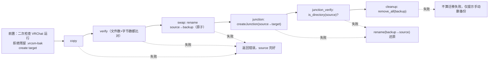

# 核心：安全删除 / NTFS 迁移 / 路径探测

> 上级：[核心子系统总览](README.md)　|　相关：[缓存与 Bundle](cache-and-bundle.md)、[数据生命周期专章](../flows/data-cache-lifecycle.md)

本页覆盖破坏性操作层：安全删除、NTFS junction 迁移、路径探测，及其共享的容器校验原语。所有操作都遵守 `CLAUDE.md` 的破坏性约束（默认 dry-run、进程守卫、保留项、不穿越 reparse point）。

## 1. 模块与调用图

| 模块 | 文件 | 职责 |
|---|---|---|
| PathProbe | `PathProbe.cpp/.h` | 解析 VRChat 数据根、可执行文件、config.json、MelonLoader、SteamVR 设置路径 |
| JunctionUtil | `JunctionUtil.cpp/.h` | 直接读写 NTFS reparse point（mount point），创建/删除/修复 junction |
| Migrator | `Migrator.cpp/.h` | 缓存目录跨盘迁移状态机（copy→verify→swap→junction→verify→cleanup） |
| SafeDelete | `SafeDelete.cpp/.h` | 缓存分类的守卫式删除，含"不穿越 reparse point"的手写递归删除 |

调用关系：`Migrator::execute` → `JunctionUtil::createJunction`（`Migrator.cpp:355`）；`Migrator::preflight` → `PathProbe::Probe` + `ProcessGuard::IsVRChatRunning`（`Migrator.cpp:157/204`）；`SafeDelete::ExecutePlan` → `ProcessGuard::IsVRChatRunning`（`SafeDelete.cpp:211`）；`JunctionUtil::Repair` → `PathProbe::Probe`（`JunctionUtil.cpp:225`）。三个模块的容器校验全部走 `ensureWithinBase`（`Common.cpp:191`），分类定义走 `categoryDefs()`（`CacheScanner.cpp:32`）。

IPC 接线：`MigrateBridge.cpp:9/22/32` 转发 `migrate.preflight`/`migrate.execute`/`junction.repair`（均在 `AsyncMethodSet`，detached worker）；删除入口 `CacheBridge.cpp:169/179` 转发 `SafeDelete::ResolveTargets/Execute`；`DatabaseBridge.cpp:507` 用 `SafeDelete::DeleteWithinRoot` 删 VRCSM 自身 AppData 缓存。

## 2. 共享容器校验原语（安全基石）

`ensureWithinBase(base, candidate)`（`Common.cpp:191-216`）是所有破坏性操作的守门人：

- 空路径直接 false（`:193`）。
- 两侧都经 `normalizeContainmentPath`（`:171-182`）：用 `absolute()+lexically_normal()` 而**非** `weakly_canonical()` —— 注释明确后者会跟随 junction，导致用户已用 junction 迁移过缓存后容器检查失效（`:173-177`）。因此 `..` 穿越被词法消解，但 junction 不被解引用。
- 逐组件 `_wcsicmp` 大小写不敏感比较（`:184-187`）；candidate 组件数少于 base 即判定不在其内（`:205`）。

`samePathLexical(a,b)` = 双向 `ensureWithinBase`，三个文件各自复制了这一定义（`SafeDelete.cpp:67`、`JunctionUtil.cpp:40`、`Migrator.cpp:104`）。

分类定义 `categoryDefs()`（`CacheScanner.cpp:32-38`）中仅 `cache_windows_player`、`http_cache`、`texture_cache` 三个是 `safe_delete=true` 的目录类缓存，也是唯一允许迁移/修复的三个根。

## 3. SafeDelete —— 守卫式删除

### A. VRChat 分类删除：`Plan` → `ExecutePlan`（`SafeDelete.cpp:169-252`）

- `Plan`（`:169`）仅对 `def.safe_delete==true` 的分类构造目标（`:177`）；每个候选必须 `ensureWithinBase(categoryRoot, ...)` 且不等于 root 本身（`:184-201`）。
- **保留项**：`cache_windows_player` 根下的 `__info` 与 `vrc-version` 永不删除 —— `kPreserveAtCwpRoot`（`:27`）+ `isPreservedCwpRootTarget`（`:88-96`），在 Plan（`:186-188`）与校验（`:154-160`）双重拦截。
- `ExecutePlan`（`:207`）：
  1. **进程守卫**：VRChat 运行则返回 `vrchat_running`（`:211-215`）。
  2. 每目标先 `validateDeleteTarget`（`:135-166`）—— 不在 baseDir 内→`escape`；不是任何 safe_delete 分类子项→`unsafe_target`；命中保留项→`preserved_target`。
  3. **顶层 reparse point 拦截**：目标本身是 junction/reparse 则拒绝（`:228-232`，`reparse_target`）。
  4. **手写递归删除 `removeTreeNoFollow`（`:106-133`）**：不用 `std::filesystem::remove_all`，因为它会跟随嵌套 junction 而删到 baseDir 外（`:233-239`）。遇任一 reparse point 子项只 `remove()` 摘除链接、绝不下探（`:116-122`）。

### B. Root 范围删除：`DeleteWithinRoot`（`SafeDelete.cpp:306-349`）

用于 VRCSM 自身 AppData 缓存（缩略图/预览/更新等）。不要求命中 VRChat 分类，只校验：空参→`invalid_argument`；`ensureWithinBase(root,target)` 失败→`escape`；等于 root→`unsafe_target`；目标不存在→返回 0（非错误）；顶层 reparse→`reparse_target`；同样用 `removeTreeNoFollow`。

**reparse point 检测**：`isReparsePoint`（`:46-56`）直接查 Win32 `FILE_ATTRIBUTE_REPARSE_POINT`，因为 `std::filesystem::is_symlink` 抓不到 junction 的 `IO_REPARSE_TAG_MOUNT_POINT`（`:42-45`）。

> [!NOTE] `Plan/ExecutePlan` 本身**无 dry-run 参数**。干跑等价物是先调 `ResolveTargets`（`:254`）拿目标列表交前端确认，再调 `Execute`。前端 Bundles 页正是这样两步操作（`delete.dryRun` → `delete.execute`），详见 [数据生命周期专章](../flows/data-cache-lifecycle.md)。`Execute` 返回双形态 JSON：成功 `{"deleted":N}`，失败 `{"error":{code,message}}`；bridge 必须把 error 形态转成 IpcException，否则前端会把失败当成功（`CacheBridge.cpp:174-188`）。

## 4. JunctionUtil —— NTFS junction 底层读写

不用 `mklink`，直接操作 reparse 缓冲区，因此**无需管理员权限**（符合项目约束）。

- **创建 `createJunction`（`:129-200`）**：要求 target 已存在、source 不存在；先 `create_directory(source)`；以 `FILE_FLAG_BACKUP_SEMANTICS|FILE_FLAG_OPEN_REPARSE_POINT` 打开；SubstituteName 加 `\??\` NT 前缀；`FSCTL_SET_REPARSE_POINT`（`:185`）。失败回滚删空目录。
- **读取 `readJunctionTarget`（`:81-127`）**：`FSCTL_GET_REPARSE_POINT`。**安全硬化**：解析前校验 `SubstituteNameOffset/Length` 在实际返回字节内且 2 字节对齐，防被构造的 mount point 触发越界读（`:110-121`）。
- **删除 `removeJunction`（`:202-213`）**：必须是 reparse point，用 `RemoveDirectoryW` 只摘链接不删目标数据。

**`Repair`（`:215-312`）** 是缓存根 junction 重建入口，边界严格：source 必须是探测到的三大缓存根之一（`isRepairableCacheRoot` `:45-71`）；target 不得位于 source 内；若 source 是真实目录，仅当其**为空**才 `remove`，非空则抛错拒绝替换（`:270-289`）—— 防误覆盖真实数据。

> [!NOTE] `JunctionUtil::Repair` 是 core 无异常契约的例外：用 `throw std::runtime_error`（`:220/:228/...`），由宿主层 try/catch 转 JSON error。

## 5. Migrator —— 迁移状态机

### preflight（`Migrator.cpp:138-212`）—— 纯预检，不改磁盘

计算 `sourceBytes`（`sizeOf` `:61-88`）、`targetFreeBytes`（`:90-102`），累积 blockers：source 不存在 / 非三大缓存根 / source==target / target 在 source 内 / target 已存在且非空或非目录 / 空间不足 / VRChat 运行中（`:149-208`）。**preflight 从不失败** —— blockers 装入 plan 交前端展示。

### execute（`Migrator.cpp:214-419`）—— 六阶段状态机

`plan.blockers` 非空立即拒绝（`preflight_blocked` `:221`）。备份路径为 `source + ".vrcsm-bak"`（`:231`），全流程围绕它做原子回滚。

设计要点：**先复制+校验、再原子 rename、最后建 junction**。任何一步失败前源数据都能通过 backup rename 原子还原（`:360-394`）；只有 junction 落地并验证通过后才删备份（`:402`）。junction 验证用 `is_directory(source)` 探测，因为破坏的 reparse point 用 CreateFile 无法区分（`:372-379`）。

### 进度事件

`MigrateBridge::HandleMigrateExecute`（`MigrateBridge.cpp:12-28`）把每个 `MigrateProgress` 回调包成 `{event:"migrate.progress", data:{phase,bytesDone,bytesTotal,filesDone,filesTotal,message}}` 推给前端，结束再推 `migrate.done`。回调从 worker 线程调 `PostMessageToWeb`，依赖 IpcBridge 的跨线程 marshal（见 [IPC 往返链路专章](../flows/ipc-roundtrip.md)）。

## 6. PathProbe —— VRChat 路径解析

`Probe()`（`PathProbe.cpp:344-390`）产出 `PathProbeResult{baseDir, vrchatExe, configJson, melonLoaderCfg, steamVrSettings, baseDirExists}`：

- **baseDir**：优先 `FOLDERID_LocalAppDataLow / VRChat / VRChat`，回退 `%USERPROFILE%\AppData\LocalLow\...`（`:348-356`）。
- **vrchatExe**：`candidateVrchatExecutables()`（`:272-324`）多源去重探测 —— 运行中进程镜像、`App Paths\VRChat.exe` 注册表、Steam App 438100 卸载键、Steam 库（`libraryfolders.vdf` 正则解析）。取 `front()` 作主候选。
- **melonLoaderCfg**：`vrchatExe 父目录 / UserData / Loader.cfg`。
- **steamVrSettings**：委托 `SteamVrConfig::DetectVrSettingsPath()`。

## 7. 安全行为小结

1. **不穿越 reparse point**：删除与迁移都拒绝跟随 junction，手写 `removeTreeNoFollow` 替代 `remove_all`。
2. **容器检查不解引用 junction**：`normalizeContainmentPath` 刻意避开 `weakly_canonical`。
3. **保留项硬编码**：`__info`/`vrc-version` 双重拦截，符合 CLAUDE.md 约束。
4. **进程守卫**：删除与迁移执行前都检测 VRChat；迁移在 preflight 后、执行前**二次检测**以覆盖确认对话框期间被拉起的情况（`Migrator.cpp:233-245`）。
5. **原子可回滚迁移**：copy→verify→rename-to-backup→junction→verify→仅全绿后删 backup。
6. **reparse 缓冲越界读防护**：`readJunctionTarget` 校验 attacker-influenceable 的 offset/length。

## 相关文件

- `src/core/SafeDelete.cpp` / `.h`、`JunctionUtil.cpp` / `.h`、`Migrator.cpp` / `.h`、`PathProbe.cpp` / `.h`、`Common.cpp`（`ensureWithinBase`）、`CacheScanner.cpp`（`categoryDefs`）
- 宿主：`src/host/bridges/MigrateBridge.cpp`、`CacheBridge.cpp`、`DatabaseBridge.cpp`、`src/host/IpcBridge.cpp`

**未验证项**：`ProcessGuard::IsVRChatRunning`、`SteamVrConfig::DetectVrSettingsPath` 内部实现属其他分区，本页仅记录调用点。
