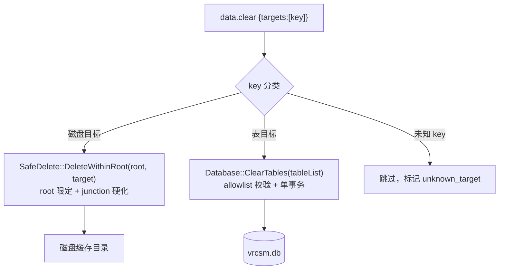
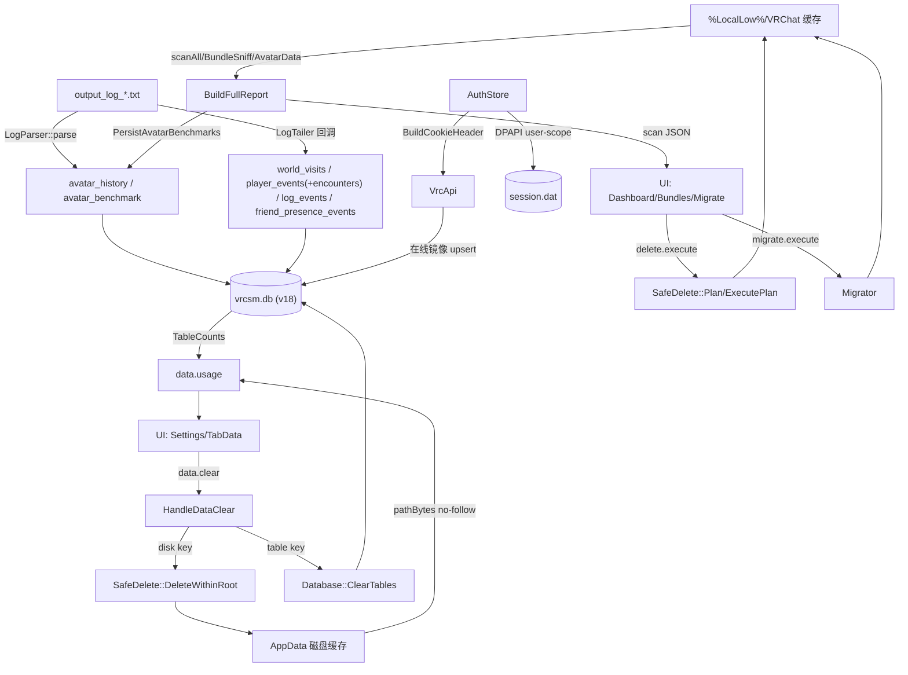

# 跨切面流程：数据与缓存生命周期

> 上级：[参考文档索引](../README.md)　|　相关：[`docs/CACHE-ARCHITECTURE.md`](../../CACHE-ARCHITECTURE.md)（缓存所有权登记表）、[头像预览/数据库](../core/avatar-preview-db.md)、[安全删除/迁移](../core/safedelete-migrate.md)

本章追踪数据从采集到持久化再到清理的完整生命周期。它是对 `docs/CACHE-ARCHITECTURE.md` 登记表的动态补充：登记表定义所有权与失效**策略**，本章描述数据在代码里的实际**流动路径**，两者不矛盾。

## 0. 存储根与两个持久化目标

- **VRChat 数据根**：`%LocalLow%\VRChat\VRChat\`（`PathProbe::Probe().baseDir`，`CacheBridge.cpp:71`）。VRChat 拥有，VRCSM 只读/索引，除非用户显式发起破坏性工作流。
- **VRCSM 自有 AppData 根**：`getAppDataRoot()` = `%LocalAppData%\VRCSM`（`Common.cpp:334-337`）。其下：`vrcsm.db`、`session.dat`、以及磁盘缓存 `thumb-cache-files`/`thumb-cache.json`/`preview-cache`/`screenshot-thumbs`/`updates`/`plugin-feed-cache.json`/`cache-index.json`。VRCSM 拥有，可创建/修剪/失效/出厂重置。

SQLite 库在进程启动时由 IpcBridge 打开一次（`IpcBridge.cpp:356`）；schema 经 `CREATE TABLE IF NOT EXISTS` + `PRAGMA user_version`（当前 v18）惰性创建/迁移。所有写路径经单连接 + `m_mutex` 串行化。

## 1. 采集侧：缓存扫描

`CacheScanner::scanAll` 对 12 类各起 `std::async` 并发统计。`BuildFullReport`（`Report.cpp:27-145`）再并发跑三路 `scanAll` + `BundleSniff::scanCacheWindowsPlayer` + `AvatarData::scan`，折叠 CWP 聚合、算 broken_links。扫描细节见 [缓存与 Bundle 文档](../core/cache-and-bundle.md)。

### scan 时的副作用写入（scan 非只读）

`HandleScan`（`CacheBridge.cpp:69-120`）会写 DB：

- `LogParser::parse` 重放 `avatar_switches`，逐条 `RecordAvatarSeen` 回填 `avatar_history`（幂等 upsert）。
- 扫描后 `PersistAvatarBenchmarks` 把 `avatar_id/parameter_count/eye_height` 快照进 `avatar_benchmark`，使 VRChat 淘汰源文件后基准仍可见（schema v17）。

日志尾随（LogTailer 回调，`LogsBridge.cpp`）是主要实时写入源：`InsertWorldVisit`、`RecordPlayerEvent`（同事务 upsert `player_encounters`）、`RecordLogEvent`、`RecordFriendPresenceEvent`。

## 2. SQLite 表结构（按用途分组）

**历史/事件（不可再生）**：`world_visits`（唯一索引 `uq_world_visits`）、`player_events` + `player_encounters`、`avatar_history`、`friend_log` 与超集 `friend_presence_events`、`log_events`、`sessions`、`notifications`（`UNIQUE(account_user_id,notification_id)`）。

**用户资产**：`local_favorites` + `local_favorite_notes` + `local_favorite_tags`（后两表 `ON DELETE CASCADE`）、`friend_notes`。

**可再生缓存（安全 drop/rebuild）**：`asset_cache`、`avatar_benchmark`、`owned_avatars`/`online_prints`/`online_inventory`/`online_files`、`avatar_embeddings_meta` + vec0 虚表 `avatar_embeddings_vec`。

**自动化**：`rules` + `rule_firings`、`event_recordings` + `event_attendees`（级联删除）。

## 3. 只读聚合：data.usage

`HandleDataUsage`（`DatabaseBridge.cpp:425-467`）返回三块：

- `disk`：对 `diskTargets()`（6 个 key→相对路径常量）用 `pathBytes` 递归求和；`pathBytes` **显式拒绝跟随 reparse point**（`:35-72`）。
- `tables`：`Database::TableCounts()` 对编译期 allowlist `kUsageCountTables` 逐表 `COUNT(*)`，先探存在性。
- `dbFileBytes`：`vrcsm.db` 文件大小。

## 4. 破坏侧：data.clear（分派到两条硬化路径）

`HandleDataClear`（`DatabaseBridge.cpp:469-563`）按请求 key 三分支：

1. **磁盘目标** → `SafeDelete::DeleteWithinRoot`（`:492-527`）。路径由 `getAppDataRoot()` + 编译期常量拼成，caller 的 key 只**选**固定项、绝不贡献路径段。`DeleteWithinRoot` 用 `ensureWithinBase` + `removeTreeNoFollow`（不穿越 junction），见 [安全删除文档](../core/safedelete-migrate.md#b-root-范围删除deletewithinrootsafedeletecpp306-349)。
2. **表目标** → `Database::ClearTables`。`tableTargets()` 把 key 映射到具体表名。`ClearTables` 先对整个请求校验 `isClearableTable`（19 项 allowlist），未知名硬报错；单事务内 `DELETE FROM "table"`。
3. **未知 key** → 跳过标记 `unknown_target`，不做默认删除。

### data.clear 前后端 target 映射

后端权威定义在 `DatabaseBridge.cpp`：磁盘目标 `diskTargets()`（`:82-93`），表目标 `tableTargets()`（`:96-112`）。前端 UI 分组 `TabData.tsx` 的 `GROUPS`（`:50-91`）分 cache / history(irreversible) / experimental / danger(需勾选确认)。

**磁盘目标**（key → 相对 `getAppDataRoot()` 路径）：`cache.thumbnails`→`thumb-cache-files/` + `thumb-cache.json`、`cache.previews`→`preview-cache/`、`cache.screenshotThumbs`→`screenshot-thumbs/`、`cache.updates`→`updates/`、`cache.pluginFeed`→`plugin-feed-cache.json`、`cache.index`→`cache-index.json`。

**表目标**（key → 一起清空的表）：`cache.assetCache`→`asset_cache`、`cache.benchmark`→`avatar_benchmark`、`cache.onlineMirror`→`owned_avatars, online_*`、`history.worldVisits`→`world_visits`、`history.playerEvents`→`player_events, player_encounters`、`history.avatarHistory`→`avatar_history`、`history.friendLog`→`friend_log, friend_presence_events`、`history.sessions`→`sessions`、`history.logEvents`→`log_events`、`experimental.embeddings`→`avatar_embeddings_meta, avatar_embeddings_vec`、`assets.favorites`→三张 favorites 表（danger 组）。

> [!WARNING] **前后端两处不同步（未来应对齐）**：
> 1. 前端 `experimental.embeddings` 仅声明 `["avatar_embeddings_meta"]`（`TabData.tsx:80`），后端实际清 `avatar_embeddings_meta` + `avatar_embeddings_vec`（`DatabaseBridge.cpp:108`）。清理正确（后端权威），但 TabData 显示的行数会少统计 `avatar_embeddings_vec`。
> 2. 前端 `cache.onlineMirror` 用 `tablePrefix:"online_"` 求和，后端用固定四表列表 —— 机制不同但覆盖基本一致。
>
> 三个页面（WorldHistory/SocialGraph/AvatarBenchmark）还有内联 Clear 按钮，复用同一 `data.clear` 后端白名单，各自只清与本页相关的 target。另有旧的独立入口 `db.history.clear` 与新统一 `data.clear` 并存。

## 5. VRChat 缓存的破坏性操作

- **删除**：`delete.dryRun`（`SafeDelete::ResolveTargets`）→ 前端确认 → `delete.execute`（`SafeDelete::Execute`，回传精确 targets 防竞态）。保留 `__info`/`vrc-version`、`ProcessGuard` 守卫、不穿越 junction。
- **迁移**：`Migrator` 六阶段状态机（copy→verify→rename→junction→verify→cleanup），原子可回滚。

详见 [安全删除/迁移文档](../core/safedelete-migrate.md)。

## 6. session.dat（按角色，无字面 secret）

`AuthStore` 会话 cookie（`auth`/`twoFactorAuth`）序列化为 JSON，经 DPAPI **user-scope** `CryptProtectData`（附静态 entropy）加密后写入 `session.dat`。解密失败降级为"已登出"而非崩溃。内存 cookie 用 `secureClearString` 擦除。详见 [认证文档](../core/api-auth-settings.md#3-authstore--会话持久化)。

## 7. 数据流总图

## 关键文件

- `src/core/CacheScanner.{cpp,h}`、`Report.cpp`、`Database.{cpp,h}`、`SafeDelete.{cpp,h}`、`Migrator.{cpp,h}`、`AuthStore.cpp`、`Common.cpp:334`
- 宿主：`src/host/bridges/DatabaseBridge.cpp`（data.usage/clear、diskTargets/tableTargets）、`CacheBridge.cpp`、`LogsBridge.cpp`
- 前端：`web/src/pages/Settings/TabData.tsx`

**未验证项**：`kUsageCountTables` 完整成员表仅读到片段；rules/event_recordings 的 `user_version` 具体编号未逐一确认。
