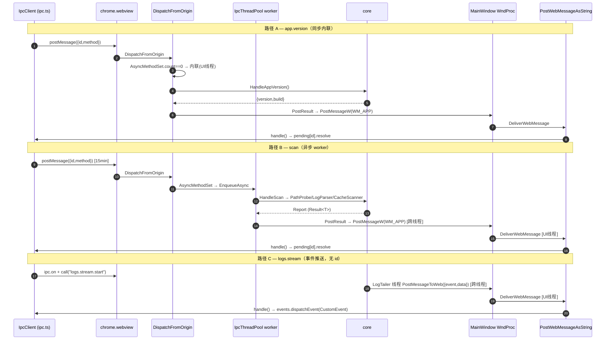

# 跨切面流程：IPC 往返链路

> 上级：[参考文档索引](../README.md)　|　相关：[架构](../01-architecture.md)、[宿主 + IPC bridge](../02-host-ipc-bridge.md)、[前端](../03-web-frontend.md)

本章追踪一次 IPC 调用从前端到 core 再回来的全过程。三种代表方法各代表一类调度语义：

| 方法 | 类别 | 调度方式 |
|---|---|---|
| `app.version` | 同步（sync inline） | UI 线程内联执行 |
| `scan` | 异步（async worker） | `AsyncMethodSet` 命中，投递到线程池 |
| `logs.stream` | 事件推送（event-push） | 无请求，host 主动 push |

所有响应/事件回程都统一经过 `PostMessageToWeb` → `WM_APP_POST_WEB_MESSAGE` → `DeliverWebMessage` → `PostWebMessageAsString`。

## 1. 通用回程机制（三条路径共用）

回程不区分方法类别，全走同一条 UI 线程 marshaling 通道：

1. Host 任意线程调 `WebViewHost::PostMessageToWeb(json, targetPluginId)` —— 堆分配 `WebPostPayload{json, targetPluginId}`，`PostMessageW(m_parent, WM_APP_POST_WEB_MESSAGE, ...)` 投递，所有权转移（`WebViewHost.cpp:88-100`）。
2. 窗口过程在 UI 线程收到 `WM_APP_POST_WEB_MESSAGE`，取回 payload 交给 `DeliverWebMessage`（`MainWindow.cpp:152-168`）。
3. `DeliverWebMessage` 用 `unique_ptr` 接管释放，转 UTF-16，若 `targetPluginId` 非空则定向到插件 iframe 的 `ICoreWebView2Frame2::PostWebMessageAsString`，否则走主 frame（`WebViewHost.cpp:111-139`）。
4. 前端 `chrome.webview` 的 message 监听器触发 `handle(raw)`（`ipc.ts:502-547`）：含 `"event"` → `EventTarget.dispatchEvent`；含 `"id"` → 从 `pending` Map 取 slot resolve/reject。

**为什么必须这一跳**：WebView2 的 `PostWebMessageAsString` 只能在 WebView2 UI 线程调用（`WebViewHost.h:47-59`）。worker 线程/tailer 线程/socket 线程产生的结果都必须经 `WM_APP_POST_WEB_MESSAGE` 编组回 UI 线程。

请求发出端也共用：`call()` 生成 uuid、组信封、按方法名决定超时（`LONG_RUNNING_METHODS` 15 分钟 / 默认 60 秒）、把 `{resolve, reject, timerId}` 存入 `pending`、`postMessage`（`ipc.ts:558-588`）。

Host 入口统一为 `add_WebMessageReceived` 回调：`TryGetWebMessageAsString` 取正文，`get_Source` 取来源 origin（取不到默认 `https://app.vrcsm/`），调 `DispatchFromOrigin`（`WebViewHost.cpp:354-390`）。

> [!WARNING] 顶层 `get_Source()` 失败时 `originUri` fail-open 到 `https://app.vrcsm/`（可信 SPA，`WebViewHost.cpp:376-379`）。插件 iframe 走独立帧通道，在 origin 为空时 fail-closed。这个顶层默认属 fail-open，见 [插件安全专章](plugin-security.md)。

## 2. 路径 A — `app.version`（同步内联）

- 调用点：`ipc.appVersion()` → `call("app.version")`（`ipc.ts:2300`）。
- Host 分流：`app.version` 不在 `AsyncMethodSet()`，命中 `m_handlers`。因 `AsyncMethodSet().count==0`，**直接在 UI 线程**执行 `it->second(params, id)` 并 `PostResult`（`IpcBridge.cpp:551-566`）。
- Handler：`HandleAppVersion` 返回 `{version, build}`（`ShellBridge.cpp:58-64`），纯常量组装，无 core 依赖。
- 回程：`PostResult(id, result)` → `PostMessageToWeb` → 通用回程 → `slot.resolve(resp.result)`。

内联意味着 handler 在 WebView2 UI 线程执行；这也是为什么慢方法必须进 `AsyncMethodSet`（`IpcBridge.cpp:92-97` 注释）。

## 3. 路径 B — `scan`（异步 worker 线程）

- 调用点：`ipc.scan()`（`ipc.ts:2401-2403`）；`scan` 在 `LONG_RUNNING_METHODS`，用 15 分钟超时。消费方如 `report-context.tsx:47`。
- Host 分流：`scan` 在 `AsyncMethodSet()`（`IpcBridge.cpp:101`），走异步分支 `EnqueueAsync(lambda)`，lambda 在**线程池 worker** 上执行 handler 并 `PostResult`/`PostError`。
- 线程池：`EnqueueAsync`（`:919-937`）递增 `m_activeAsyncTasks`（`m_drainingAsync` 时返回 false → `shutting_down`），投递 `GetIpcPool().enqueue`；worker 执行前查 `*m_alive`，`scope_exit` 保证 `FinishAsyncTask`。池为固定大小（`hardware_concurrency` 夹 2..8），进程级单例。
- 核心：`HandleScan`（`CacheBridge.cpp:69-120`）调 `PathProbe::Probe` → `LogParser::parse` 回填 → `CacheScanner::buildReport` → `PersistAvatarBenchmarks` → `ToJson`。core 用 `Result<T>`，失败时 bridge 转 JSON error。
- 回程 marshaling：worker 线程 `PostResult` → `PostMessageToWeb` **跨线程** `PostMessageW` → UI 线程 `DeliverWebMessage` → `PostWebMessageAsString`。前端 pending slot resolve。

## 4. 路径 C — `logs.stream`（事件推送，无 id）

- 订阅：`BottomDock` 用 `ipc.on("logs.stream", cb)`（`BottomDock.tsx:57`）+ 先 `ipc.call("logs.stream.start")` 触发 host 建 tailer。
- Host 建流：`logs.stream.start`（async，注册 `IpcBridge.cpp:769`）→ `HandleLogsStreamStart` 引用计数，首个订阅者构造 `LogTailer` 并注册回调（`LogsBridge.cpp:86-172`）。
- 事件产生：`LogTailer` 在**自己的 tailer 线程**逐行回调；回调先检查捕获的 `alive` shared_ptr（防析构竞态），组 `{line, level, source, timestamp}`，直接 `PostMessageToWeb({"event":"logs.stream","data":...})`（`LogsBridge.cpp:172-199`）。
- 回程 marshaling：同 scan，tailer 线程 → `WM_APP_POST_WEB_MESSAGE` → UI 线程。
- 前端分发：`handle()` 见 `"event"` → `events.dispatchEvent(CustomEvent)` → `BottomDock` 的 `on` 监听器。无 pending slot，无 Promise，无 id。

> [!NOTE] `logs.stream` 事件推送**不走** `PostEventToUi` 封装，而是在 tailer 回调里直接手拼 `{"event","data"}` 调 `PostMessageToWeb`（`LogsBridge.cpp:195-198`）；`pipeline.event`、`update.progress`、`migrate.progress` 等则用 `PostEventToUi`（`IpcBridge.cpp:873-883`）。两者最终都汇聚到同一条 `WM_APP_POST_WEB_MESSAGE` 通道，前端也用同一个 `handle()` 的 `"event"` 分支处理，对前端完全等价。

## 5. 时序图

## 6. 优雅关闭

`~IpcBridge`（`IpcBridge.cpp:389`）设 `*m_alive=false`、`m_drainingAsync=true`，等 `m_activeAsyncTasks==0`，再销毁 LogTailer（避免回调线程 use-after-free）。`EnqueueAsync` 在 draining 时返回 false，Dispatch 回 `shutting_down`。`PostResult/PostError/PostEventToUi` 均先查 `*m_alive` 再编组，可安全从任意线程调用。

## 关键文件

- 前端：`web/src/lib/ipc.ts`（`call` 558-588、`handle` 502-547、`on` 549-556、超时表 339-371）
- Host 入口：`src/host/WebViewHost.cpp`（`add_WebMessageReceived` 354-390、`PostMessageToWeb` 88-100、`DeliverWebMessage` 111-139）
- 分发：`src/host/IpcBridge.cpp`（`DispatchFromOrigin` 442-576、`AsyncMethodSet` 98-293、线程池 30-90、`EnqueueAsync` 919-937、`PostResult/PostEventToUi/PostError` 857-917）
- UI 线程 marshaling：`src/host/MainWindow.cpp:152-168`
- Handler 示例：`ShellBridge.cpp:58-64`（sync）、`CacheBridge.cpp:69-120`（async）、`LogsBridge.cpp:170-234`（event-push）
- 前端消费：`web/src/components/BottomDock.tsx:57-85`、`web/src/lib/report-context.tsx:47`
