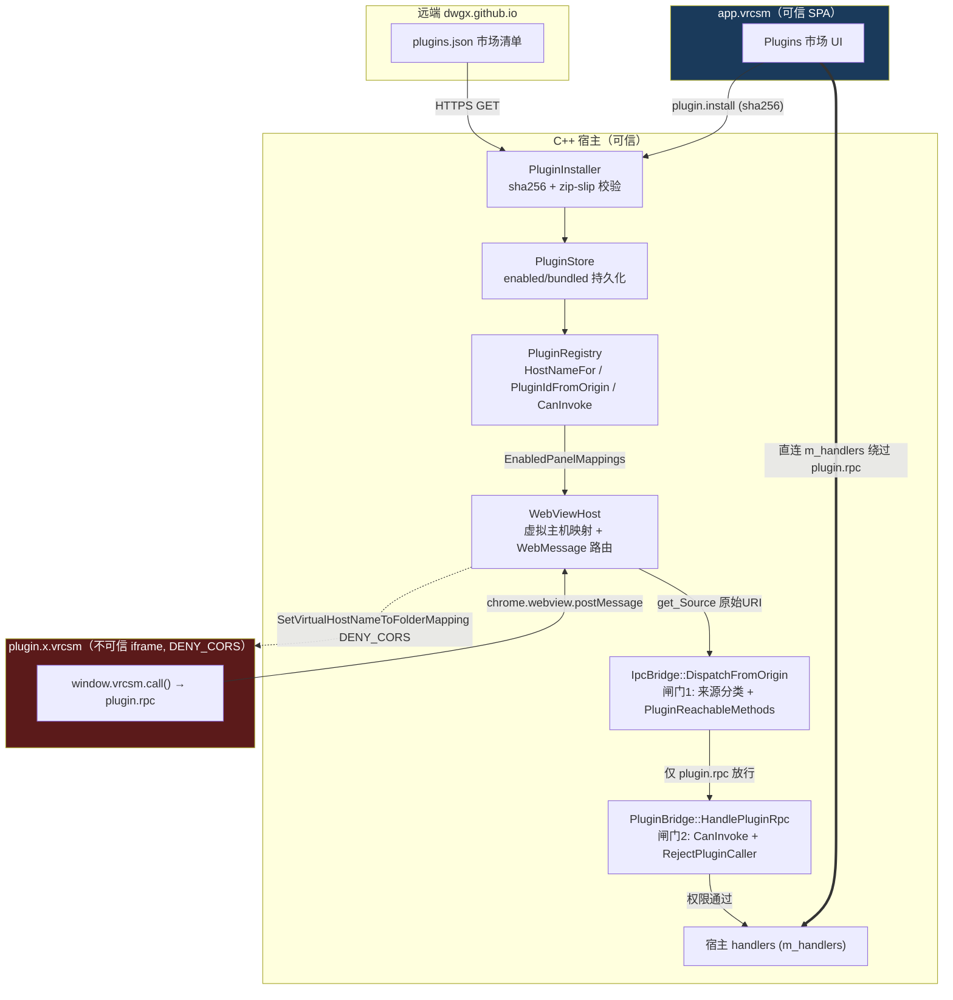

# 跨切面流程：插件安全模型

> 上级：[参考文档索引](../README.md)　|　相关：[核心 hw/updater/plugins](../core/hw-updater-plugins.md)、[宿主 + IPC bridge](../02-host-ipc-bridge.md)、[IPC 往返链路](ipc-roundtrip.md)

本章追踪插件从安装到运行的完整信任边界。VRCSM 对每个插件面板用独立 WebView2 虚拟主机 `plugin.<sanitised-id>.vrcsm` 承载，与可信 SPA `app.vrcsm` 隔离。插件无法直接调用宿主 handler，只能经 `plugin.rpc` 一个入口，穿过两道权限闸门。

## 1. 信任模型总览

## 2. 逐段追踪

**(A) 清单 `PluginManifest`** —— 严格 schema（`PluginManifest.cpp:180-283`）：id 必须 `[a-z0-9._-]`、3..96、sanitise 后自身一致；version/hostMin 合法 SemVer；shape ∈ panel/service/app。`permissions` 是**插件自声明**字符串列表，未知 token 静默丢弃（前向兼容）。

**(B) 市场 feed `PluginFeed`** —— 默认 `https://dwgx.github.io/VRCSM/plugins.json`，WinHttp + `WINHTTP_FLAG_SECURE`，5 分钟缓存，网络失败回退陈旧缓存。条目带 `download`(URL) 与 `sha256`。

**(C) 安装校验 `PluginInstaller`** —— 七步纵深防御（详见 [核心文档](../core/hw-updater-plugins.md#plugininstaller-七步267-386--zip-slip-纵深防御)）：sha256（可选）→ zip magic → tar 拒 `../` → `VerifyNoEscape`（拒 symlink/reparse + canonical 前缀检查）→ hostMin 门 → 原子交换。

**(D) 注册 + 虚拟主机命名 `PluginRegistry`** —— `HostNameFor` = `plugin.<id-点换横线>.vrcsm`（`:72-75`）。`PluginIdFromOrigin`（`:77-115`）从 `get_Source()` URI 剥 scheme/path/port 取 label，横线换回点，遍历已装插件按 sanitised-label 匹配。

**(E) WebViewHost 每插件隔离** —— `RefreshPluginMappings` 为每个启用面板插件映射虚拟主机，**关键用 `DENY_CORS`**（`WebViewHost.cpp:659-662`），插件间及对 app.vrcsm 的跨源 fetch/XHR 被阻断，只能走 postMessage。顶层 `add_WebMessageReceived` 只收主帧消息；插件 iframe 消息经 `add_FrameCreated` → `Frame2::add_WebMessageReceived` 单独通道，用 `get_Source()` 取来源并缓存帧引用以定向回投响应。

**(F) 闸门1 — `DispatchFromOrigin` + `PluginReachableMethods`** —— 来源分类（`IpcBridge.cpp:459-469`）：能解析为插件 id → `callerPluginId`；否则 host 必须 `app.vrcsm`，其它 `forbidden_origin`。插件来源时 `PluginReachableMethods()` 只含 `plugin.rpc`（`:300-306`），其它方法直接 `forbidden_origin`。**这是原点安全缝**。

**(G) 闸门2 — `HandlePluginRpc` + `RejectPluginCaller`** ——
- 空 caller 拒绝；显式拦 `plugin.*`（`PluginBridge.cpp:316-321`）；`CanInvoke` 校验插件已装+已启用+权限表命中。
- 权限表 `PermissionTable`（`PluginRegistry.cpp:31-52`）粗粒度 token→方法集；`FreeMethods` 免声明（`app.version`/`path.probe`/`process.vrcRunning`）；`plugin.*` 在此再次硬拒。
- **额外硬编码防御**：即便持 shell 权限，`shell.openUrl` 的 `vrchat://` scheme 被拒（防插件触发已认证的自我传送/账户变更）（`PluginBridge.cpp:338-348`）。
- 管理方法 `plugin.list/install/uninstall/enable/disable/marketFeed` 每个入口都 `RejectPluginCaller`（第二道防线）。

**(H) 插件能/不能调用什么**
- **能**：`plugin.rpc` 包裹下、且在 `FreeMethods` 或已声明权限 token 覆盖的方法（scan/bundle.preview/auth.status/avatar.details/logs.stream.*/settings.*/fs.*/shell.pickFolder/shell.openUrl 等）。
- **不能**：任何 `plugin.*`、`vrchat://` 启动、未声明权限的方法、直接调用非 `plugin.rpc` 的宿主方法、跨源访问 app.vrcsm 或其它插件（DENY_CORS）。

**(I) 原点如何被认证** —— 由 WebView2 浏览器进程设置的 `get_Source()` 帧 URI 决定，插件 JS 无法通过 postMessage 伪造自身 origin —— 这是信任根。

## 3. 已知弱点（维护者需知）

> [!WARNING] **原点身份认证是"sanitised-label 匹配"，非精确匹配 —— 存在同宿主碰撞**
> `PluginIdFromOrigin` 把横线换回点后遍历已装插件取**第一个** sanitised-label 相同者（`PluginRegistry.cpp:98-114`）。id 中的点和横线都被归一为横线，故 `dev.vrcsm.hello` 与 `dev-vrcsm-hello` 映射到同一虚拟主机。若两者同时安装，来自该来源的调用会被归因到迭代顺序中首个匹配插件，其声明权限可能与真实来源不同。代码注释自陈"id-in-label ambiguity"但仅"prefer exact match if one exists" —— 实际循环并未优先精确匹配，只返回首个 label 相等者。

> [!WARNING] **权限为插件自声明，安装期无逐权限用户同意闸**
> 权限来自 manifest 的 `permissions` 数组（`PluginManifest.cpp:249-255`），安装流程仅校验 sha256/zip-slip/hostMin，未见对声明权限的用户确认。安装即授予全部声明权限（fs 读写、settings 读写、auth 状态、好友列表等）。（前端市场 UI 在安装前会展示权限 token 供人工审阅，但这是 UI 提示而非宿主强制闸。）

> [!WARNING] **手动 URL 安装不强制 sha256；feed 本身无签名**
> `HandlePluginInstall` 注释明确"manual URL installs may pass it too but the handler does not mandate one"（`PluginBridge.cpp:145-146`）。sha256 与下载 URL 同源自 github.io，只防传输损坏，不构成对恶意 feed 的防护 —— 无插件代码签名。

> [!WARNING] **顶层 WebMessage 来源解析失败时 fail-open 到可信来源**
> `WebViewHost.cpp:376-379`：顶层 `get_Source()` 失败时 `originUri` 默认回落为 `https://app.vrcsm/`（可信 SPA）。该顶层通道注释称只投递主帧、插件走独立帧通道（帧通道在 origin 为空时 fail-closed 返回），但顶层此默认是 fail-open。

次要项：`FreeMethods` 免权限暴露 `path.probe`（文件系统路径信息泄露）；`ipc:fs:*` 权限粒度较粗（listDir/writePlan/appDataDir）。

## 4. 关键文件

- `src/core/plugins/PluginManifest.{h,cpp}`、`PluginFeed.{h,cpp}`、`PluginInstaller.cpp`、`PluginRegistry.{h,cpp}`、`PluginStore.cpp`
- `src/host/IpcBridge.cpp`（闸门1 `DispatchFromOrigin` :442 / `PluginReachableMethods` :300 / `InvokeHostHandler` :586）
- `src/host/bridges/PluginBridge.cpp`（闸门2 `HandlePluginRpc` :296 / `RejectPluginCaller` :89 / `vrchat://` 硬拒 :338）
- `src/host/WebViewHost.cpp`（虚拟主机 DENY_CORS :614 / 帧消息路由 :354,:409）
- `plugins/hello/sdk-bundle.js:95`（插件侧 `window.vrcsm.call` 封装为 `plugin.rpc`）
